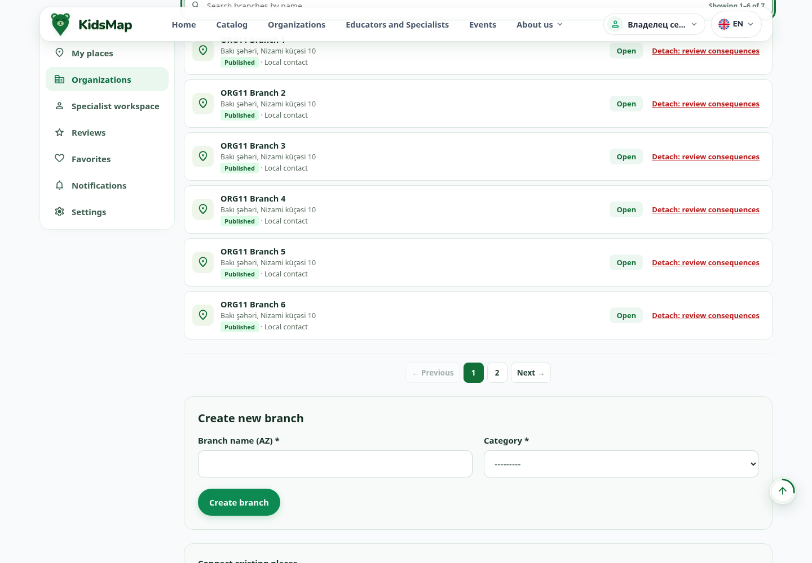
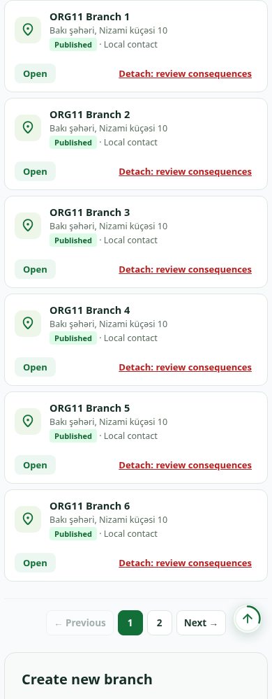

# ORG-11 — локальная проверка и исправление, 2026-10-09

Исправлены доступные имена пагинации филиалов и аналогичного поиска самостоятельных мест. Пагинация стала native `nav`, поэтому браузер теперь видит именованную область навигации. Изменены две строки одного шаблона; JS/CSS, права, владение, публикация, canonical transitions и PO/MO не менялись.

## Снимок и изоляция

- LOCAL HEAD: `2da9d33abbc53d1ac71bcb7e15a0170bef6277d5`, `task33-progress`, dirty WORKTREE.
- Входной снимок:5798 файлов;5796 неизменны побайтно. Из существующих изменены только organization_workspace.html и журнал implementation-status.md. Дополнительно созданы собственные план/отчёт/доказательства.
- До исправления source2761 SHA `f86c1cfb4b308f2e5ec7976430e959b48e87e56dd70a9f76c770d2cc4e77e657`; после `dbaa521711d81ab777802bdb9c70a9f9e9caa7d95f673fe87fe460e9e9e17618`. Шесть PO/MO неизменны. Runtime manifest совпал с `/qa/acceptance-version/`.
- Stand `http://localhost:8788/qa/`, DJANGO_TESTING=1, locmem cache/email, изолированные media/private-media; внешние credentials отсутствуют. PostgreSQL container `kidsmap-content-entry-final-20261007`:network none, без опубликованных портов. Unit tests — отдельный container `kidsmap-content-final-tests-20261007`; тестовая DB уничтожена после прогона.
- Создана synthetic organization67 с семью готовыми филиалами89–95 через create_organization/request_join. Synthetic employee EDITOR получил organization.view/place.view через invite/accept, не прямое изменение связей.
- До/после548 прежних domain rows в17таблицах совпали по SHA. Новые строки только fixture:1organization/7places/7approved requests/1grant/1accepted invitation; canonical links сохранены. Галерея/занятия/группы/цены/расписание старых данных неизменны. Новые fixture rows не имели отдельного pre-browser hash-снимка: проверены количество, ожидаемые имена/владелец/связи/статусы; browser не отправлял бизнес-POST.
- Production, commit/push/deploy не выполнялись.

## Первопричина и diff

В шаблоне aria-label были literal RU, хотя соседние подписи уже использовали CURRENT_LANGUAGE. Пагинация была generic div, без navigation role. У organization index такой же literal RU обнаружен у поиска мест. Общая навигация/поиск филиалов и этапы подключения уже локализованы.

Пагинация: RU «Пагинация филиалов», AZ «Filialların səhifələnməsi», EN «Branch pagination». Поиск: RU «Поиск по местам», AZ «Məkan axtarışı», EN «Place search». Использованы существующие inline language branches. Пагинация по6 карточек и data-selectors сохранены.

[Локальный diff относительно входного WORKTREE](org-11-fix-2026-10-09/evidence/local.diff), [утверждённый план](../superpowers/plans/2026-10-09-org-11-accessible-pagination.md).

## Свежие результаты

| Проверка | Результат | Граница доказательства |
|---|---|---|
| RED, текущая версия до правки |3PASS/12FAIL |6 отсутствующих navigation landmarks,4 неверных AZ/EN имён пагинации,2 неверных имён поиска |
| GREEN тех же доступных имён |15PASS/0FAIL |Owner/employee RU/AZ/EN + owner index |
| Rendered Chromium matrix |478PASS/0FAIL |2роли ×3языка ×360/390/768/1024/1280/1440; страницы1/2,6+1карточек, disabled boundaries, поиск/пустой результат/сброс/reload |
| Клавиатурное включение страниц |PASS |Tab→2, Enter→страница2, Space→страница1; повторное действие |
| Сохранение фокуса после смены страницы |FAIL, отдельный finding |36/36 contexts: activeElement BODY. Не включён в478PASS |
| Чужой доступ |PASS |Synthetic outsider:404 во всех3языках, без названий филиалов |
| Бизнес-записи browser |PASS |0бизнес-POST;548 старых domain rows неизменны |
| Targeted server regressions |47PASS/0F/0E |Создание/черновик, canonical join/pending/confirmation/stale detach, scoped rights, invitation repeat/conflict, concurrent revoke/transfer |
| Browser page errors |PASS |0pageerror. Внешние запросы блокированы; полного анализа network responses матрица не сохраняла |
| Visual PC/mobile |PASS в области ORG-11 |12скриншотов390/1440 RU/AZ/EN для2ролей просмотрены; горизонтального overflow нет во всех36контекстах |
| Реальный экранный диктор/устройство |NOT RUN |Accessible role/name проверены браузером, NVDA/VoiceOver/TalkBack не запускались |
| Полный suite/полный lifecycle всех сущностей |NOT RUN |Не входят в ORG-11;47 targeted tests не заменяют полную приёмку |

## Команды и доказательства

```bash
.venv/bin/python .tmp/org11-fix-20261009/run.py --script fixtures.py
.venv/bin/python .tmp/org11-fix-20261009/run_browser.py browser_red
.venv/bin/python .tmp/org11-fix-20261009/launch.py
.venv/bin/python .tmp/org11-fix-20261009/run_browser.py browser_green
.venv/bin/python .tmp/org11-fix-20261009/run_browser.py browser_matrix
.venv/bin/python .tmp/org11-fix-20261009/run_unit.py catalog.testcases.test_task33_organization_workspace catalog.testcases.test_task33_permissions
.venv/bin/python .tmp/org11-fix-20261009/run.py --script db_verify.py
```

Fixtures:1сеть/7филиалов; RED3/12, GREEN15/0, matrix478/0. Server47tests,26.261s,OK,exit0; полный terminal transcript не сохранён, summary в unit-results.json. DB verify548unchanged. Runtime launch final PID2840471/source unchanged; финальный metadata restart исправил формат worktree_status в собственном manifest,206entries вместо длины строки. Проверен runtime digest после рестарта.

При восстановлении окружения прежние server/browser session отсутствовали: первый RED runner не смог открыть session. Это ошибка запуска harness; после восстановления own session выполнен свежий успешный RED. Исторические отчёты не использованы как PASS.

[RED](org-11-fix-2026-10-09/evidence/browser_red.json), [GREEN](org-11-fix-2026-10-09/evidence/browser_green.json), [матрица](org-11-fix-2026-10-09/evidence/browser_matrix.json), [server summary](org-11-fix-2026-10-09/evidence/unit-results.json), [DB](org-11-fix-2026-10-09/evidence/db-after.json), [сохранность файлов](org-11-fix-2026-10-09/evidence/preservation.json), [runtime](org-11-fix-2026-10-09/evidence/runtime-observed.json).

## Отдельная задача — ORG-PAGINATION-FOCUS-01 / P2

Роли owner/employee. URL `/en/account/organizations/67/` (также RU/AZ). Tab на2 → Enter. Ожидание: фокус остаётся на активной кнопке/предсказуемом элементе пагинации. Факт: activeElement BODY во всех36контекстах. Доказательство: matrix.json/focus. Область: static/js/organization_workspace.js, renderPagination заменяет innerHTML; JS в этом scope не изменялся. Это текущая подтверждённая проблема, отдельного до-исправления browser-воспроизведения фокуса нет. Исправление: сохранить фокус при перестроении пагинации и проверить продолжение Tab/Shift+Tab, disabled boundaries, repeat, search reset. В ORG-11 не исправлялась.

## Скриншоты

[Все12 и обзор](org-11-fix-2026-10-09/screenshots/overview.png). Примеры EN:





ORG-11 завершён в заявленной области. ORG-12 и другие findings не исправлялись.
