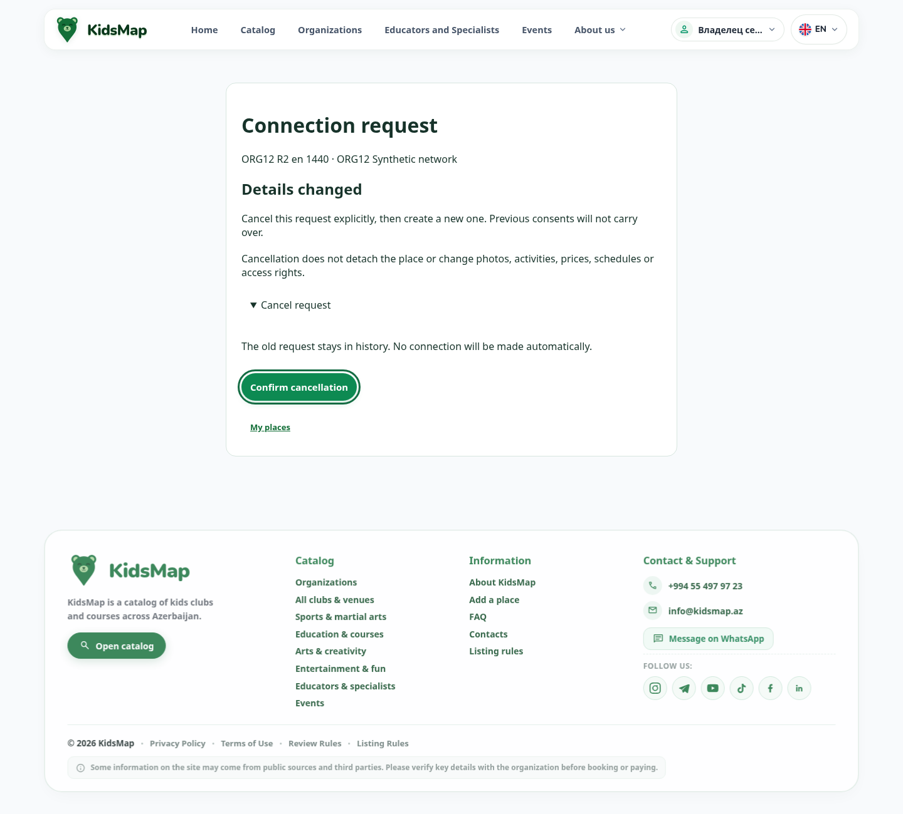
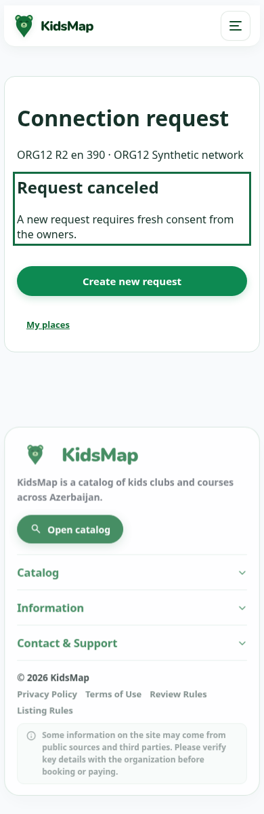
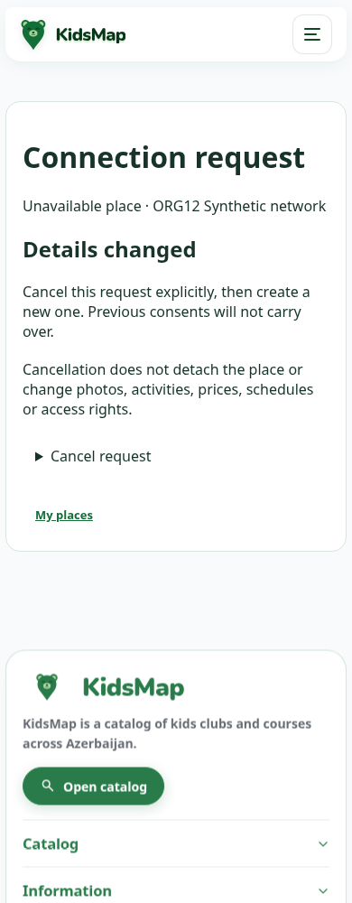

# ORG-12 — восстановление устаревшего запроса, 2026-10-09

ORG-12 исправлен локально в согласованной области. Устаревший business join можно явно отменить и отдельно создать новый запрос с актуальной версией и новыми согласиями. Отмена не отсоединяет место и не выдаёт права. Общую готовность приложения этот отчёт не подтверждает: ниже есть отдельные FAIL и NOT RUN.

Execution: Codex primary /root; source/Django/security/browser проверены последовательно одним исполнителем. Независимые агенты не запускались. [План и согласованные последствия](../superpowers/plans/2026-10-09-org-12-stale-join-lifecycle.md). Пользователь согласовал его сообщением «дальшн».

## Снимок и границы

- LOCAL HEAD `2da9d33abbc53d1ac71bcb7e15a0170bef6277d5`, branch `task33-progress`; dirty WORKTREE сохранён. PRODUCTION UNKNOWN, не подключались.
- Вход:5832 nonignored файлов. Финально изменены10 существующих application files + собственные journal/согласованный plan;5820 остальных побайтно неизменны. Дополнительно4 новых application files и собственные документы/доказательства. Согласованный plan обновляется отдельно, его входной текст сохранён в истории этого задания; окончательная сохранность учитывает его как собственное изменение.
- Финальный source2765 SHA `15b17b6841eec1c343ccda6d413e07e899151ac1691788981ef3ce17d2222f77`; совпадает с работающим runtime.6PO/MO неизменны.166 входных model/migration файлов неизменны.
- Stand `http://localhost:8788/qa/`. DJANGO_TESTING=1, отдельные synthetic DB/media/private-media, LocMem cache/email, сетевые/DB guards. PostgreSQL browser container `kidsmap-content-entry-final-20261007`: network none,0published ports. Unit tests используют отдельный `kidsmap-content-final-tests-20261007`; test DB уничтожена после прогона. External credentials отсутствуют; browser блокировал внешние запросы.
- Без commit/push/deploy/production. Чужие изменения, ORG-01–11 и остальные findings не исправлялись.

## Причина и исправление

Свежая pre-fix проверка в откатившейся synthetic transaction подтвердила: обе стороны и повторный request_join получают `Request is stale.`, pending остаётся, preview manual_review. Проверка content_version в confirm была правильной; безопасного cancel/re-request транспорта не было.

Добавлены:

1. Canonical cancel_join с locks Organization→Place→request. Только текущий прямой владелец одной из сторон, только business. Staff/employee/former owner/author не приобретают право отмены.
2. Actor/request-bound state token на30минут. В браузер передаётся keyed HMAC состояния, без private owner IDs и version payload. Проверка CAS выполняется под locks; подпись/expiry/изменение родителей или запроса запрещают запись. Во время разработки читаемый state payload пойман новой регрессией и исправлен до handoff.
3. Новые POST+CSRF HTML cancel и additive JSON action cancel-join. GET не меняет request. API strict payload; invalid400/forbidden403/missing404/conflict409; success содержит только request_id/status. Старые actions и payloads сохранены.
4. Отмена pending→canceled сохраняет старые consents/bases, decided_at/by и note. Approved нельзя отменить: detach остаётся отдельным canonical процессом. Archive/delete не препятствуют прекращению pending; линк не меняется.
5. Повтор отмены проверяет текущие права, возвращает canceled без дополнительных side effects. Старый request ID не отменяет новый pending. Confirm/cancel гонка имеет одного победителя.
6. Отдельная «Создать новый запрос» ведёт в существующие поиск/preview/consent. Новая запись получает актуальные bases и новые confirmations. Разные владельцы должны подтвердить заново; действующее правило одного владельца обеих сторон не изменено.
7. RU/AZ/EN recovery page, native details/summary, POST без JS, loading/single-flight с JS, фокус результата/ошибки. Ссылки добавлены в кабинет сети, существующий owner places dashboard и connection search/preview. Скрытые pending вынесены в отдельный безопасный display-list; прежний pending_requests ACL-контракт сохранён.
8. Private place/org names не показываются без существующего visibility gate. После отмены согласие не восстанавливает доступ к private карточке. Новый запрос к private месту начинает его текущий владелец через уже существующий place-side connection flow; metadata private сети там также не раскрывается новым recovery UI.

Информационные связи, владение, публикация, site switches, program/grant актуальность и прочие canonical guards не менялись. Автоматической отмены stale по content или переноса сети нет. Новых миграций/backfill/notification delivery нет.

[Local diff относительно входного WORKTREE, включая новые файлы](org-12-fix-2026-10-09/evidence/local.diff).

## Проверки

| Проверка | Результат | Что выполнено |
|---|---|---|
| Первичный RED |6FAIL/6ERROR,12tests |Нет recovery service/route; no safe recovery assertion падает. Не использован как свежий PASS |
| Первый GREEN |12PASS |Cancel/new consent/replay/rights/CSRF/JSON/archive/delete |
| Расширенный начальный набор |2FAIL/1ERROR,148tests |Законная private visibility и прежний pending context; fixture category отсутствовала после TransactionTestCase flush. Исправлены код и fixture setup, assertions не ослаблялись |
| Повтор расширенного набора |148PASS |Ownership/workspace/permissions/visibility/connections/concurrency |
| Focused после CSS/include уточнений |37PASS |Recovery + ORG01 visibility |
| Privacy token RED |1FAIL |Client-readable token содержал owner IDs/version list |
| Финальный hardened сервер |**149PASS,0F/0E/0skip**,85.749s |23 recovery tests + прежние contracts, actual PostgreSQL races; test DB destroyed |
| Recovery UI RU/AZ/EN×360/390/768/1440 |115PASS/3 ранних focus FAIL |12полных native cancel/reload flows; keyboard disclosure/confirm, отдельный new request, neutral private state, employee404.3 focus checks сделаны до load/defer script |
| Focus повтор после load |12PASS |Все12 result-focus contexts |
| Финальная accessibility read matrix |75PASS |12contexts×6:focus/status/name/Tab/44px/overflow +3error checks;0pageerrors |
| Две вкладки/noJS/lost-response |10PASS/1 ранний focus FAIL +1prepare PASS |Content CAS409 обеих вкладок, reload/cancel, no-JS native keyboard/POST/PRG, response aborted AFTER server commit, read-only reopen/replay. Focus ошибки разрешён последующим75PASS после load |
| Финальный HMAC browser lifecycle |11PASS |Новый UI request→native cancel→новый request→JSON replay старой отмены→отдельное согласие place owner; новый pending не отменяется replay; private name hidden |
| Кабинеты обоих владельцев,3языка×4ширины |141PASS/**3FAIL** |Row/recovery link44px/keyboard/private metadata PASS; owner places document overflow815 при768 во всех3языках |
| Existing domain preservation |PASS |565старых rows в17таблицах SHA unchanged; никакого нового grant |
| Model/system check |PASS |Django system check0issues;166model/migration файлов unchanged |
| makemigrations check/dry-run |**FAIL,exit1** |Предлагает Meta options для Activity/OfferingGroup/Organization/Program; в default locale и RU. Файлы не созданы; этот code drift уже присутствовал на входе по неизменности model/migration source |
| Console |**FAIL отдельно** |ViewTransition opt-in disabled:1pageerror в первоначальной recovery matrix,6 в финальном lifecycle при переходах в старые страницы. Все7однотипные; не исправлялись. Последние cabinet/accessibility матрицы0pageerrors |
| Реальные дикторы/устройства/другие browsers |NOT RUN |Chromium keyboard/roles/focus не заменяет NVDA/VoiceOver/TalkBack или native device |
| Полный suite/все сущности/production |NOT RUN |149targeted не заменяет полный server suite и полную приёмку KidsMap |
| Gallery UI/program/group/pricing/schedule lifecycle |NOT RUN отдельно |Существующие domain rows сохранены; новые cancel fixtures не имели собственной галереи/занятий. Двоичные media files отдельно не хешировались |
| Archive/delete discovery в UI, informational UI lifecycle |NOT RUN |Cancel authority проверена server/HTTP; browser archive navigation/informational moderation отдельно не пройдены |

Browser scripts сохраняют rows отдельно от pageerrors. Нулевое поле network в summaries не доказывает отсутствие failed HTTP responses: matrix собирала pageerrors, внешние requests блокировала, полного response audit не выполняла.

## Изолированные данные

Финально добавлено:1draft organization69,28мест,37requests.34canceled сохраняют старые confirmations и ровно одну note отмены;2approved связали два разных synthetic места через canonical consent;1pending — намеренно оставленный stale private example для ручной проверки. Новых grants/программ/занятий/групп/цен/расписания/фото нет. Владельцы28мест неизменны. Старые565domain rows неизменны.

Лишние synthetic fixtures появились из-за повторов после harness ошибок; они изолированы и не удалялись. Самый ранний reproduction ORG12 plan полностью откатился. Browser QA login изменяет synthetic auth/session данные, эти таблицы не входят в утверждение о565domain rows.

## Ошибки harness и пределы выводов

Сохранены реальные промежуточные результаты; не представлены как app PASS. Были: запуск browser до readiness сервера; strict-mode CSRF selector; no-JS вход через JS-generated QA guide; гонка chrome error navigation после intentional response abort; assumption стандартного имени CSRF cookie; selector отменённого вместо нового pending ID; неверный GET selector у существующей POST search form. Исправления harness выполнялись без изменения бизнес-assertions. Повторы использовали свежие isolated requests. В failing HTML diagnostics tokens отредактированы перед сохранением evidence.

3result-focus и1error-focus FAIL исчезли при проверке после load: фокусирует defer script. Final75PASS подтверждает доступный результат; это не доказательство работы реального диктора.

## Отдельные задачи, не исправлялись

**ORG-OWNER-768-OVERFLOW / P2.** Place-side owner, `/en/account/places/`, также RU/AZ, width768. Ожидание scrollWidth≤768; факт815. Удаление только новых data-join-request rows оставляет815; удаление всего organization-links section также оставляет815. Проблема вне нового recovery блока, точная первопричина оставшихся элементов ещё не установлена. Scope следующей задачи: rendered responsive audit старого owner places layout/nav; доказательство browser_overflow_probe.json и cabinet matrix. Приоритет ограниченного viewport/layout бага; не заявляется потеря данных.

**EXISTING-VIEWTRANSITION / P2.** Старые переходы cabinet/connection screens иногда дают `Transition was aborted because of invalid state. ViewTransition opt-in disabled`. Итоговые11domain checks проходят, console acceptance FAIL. Scope: общий navigation motion. Старые отчёты уже отмечали этот тип ошибки; текущие7events подтверждены отдельно.

**EXISTING-META-MIGRATION-DRIFT / P2.** Guarded `makemigrations --check --dry-run` exit1 предлагает4Meta options.166model/migration source files совпадают с входом. Scope: отдельно сверить migration state и текущие verbose_name options и решить совместимость; migration/deploy в ORG12 не выполнялись.

ORG-PAGINATION-FOCUS-01 из ORG11 также не входил в ORG12 и здесь не исправлялся.

## Команды

```bash
.venv/bin/python .tmp/org12-fix-20261009/run_unit.py catalog.testcases.test_organization_join_recovery
.venv/bin/python .tmp/org12-fix-20261009/run_unit.py catalog.testcases.test_organization_join_recovery.JoinRecoveryTests.test_browser_token_does_not_disclose_private_owner_or_versions
.venv/bin/python .tmp/org12-fix-20261009/run_unit.py catalog.testcases.test_organization_join_recovery catalog.testcases.test_task33_ownership catalog.testcases.test_task33_organization_workspace catalog.testcases.test_task33_permissions catalog.testcases.test_organization_join_visibility catalog.testcases.test_organization_connections catalog.testcases.test_organization_connections_concurrency
.venv/bin/python .tmp/org12-fix-20261009/run_unit.py --script checks.py
.venv/bin/python .tmp/org12-fix-20261009/run_unit.py --script checks_ru.py
.venv/bin/python .tmp/org12-fix-20261009/launch.py
.venv/bin/python .tmp/org12-fix-20261009/run_browser.py browser_matrix
.venv/bin/python .tmp/org12-fix-20261009/run_browser.py browser_negative_pre
.venv/bin/python .tmp/org12-fix-20261009/run.py --script mutate.py
.venv/bin/python .tmp/org12-fix-20261009/run_browser.py browser_negative_post
.venv/bin/python .tmp/org12-fix-20261009/run_browser.py browser_accessibility_final
.venv/bin/python .tmp/org12-fix-20261009/run_browser.py browser_cabinet_corrected
.venv/bin/python .tmp/org12-fix-20261009/run_browser.py browser_overflow_probe
.venv/bin/python .tmp/org12-fix-20261009/run_browser.py browser_hardened_complete
.venv/bin/python .tmp/org12-fix-20261009/run.py --script db_verify.py
```

Fixtures scripts и IDs сохранены в evidence. Browser cancellation scripts нельзя повторять на уже canceled fixtures как fresh happy path — нужна новая isolated fixture. Guarded unit suites имеют exact exits в отчёте выше; runner/browser parse-error сам по себе мог иметь shell exit0, поэтому JSON/logs прочитаны отдельно. Intentional synthetic RuntimeError из fault-injection test в server log не означает error тестового набора.

## Доказательства и скриншоты

[149server tests](org-12-fix-2026-10-09/evidence/unit-hardened-final.log), [privacy RED](org-12-fix-2026-10-09/evidence/unit-token-red.log), [финальный browser lifecycle](org-12-fix-2026-10-09/evidence/browser_hardened_complete.json), [accessibility75](org-12-fix-2026-10-09/evidence/browser_accessibility_final.json), [cabinet141/3](org-12-fix-2026-10-09/evidence/browser_cabinet_corrected.json), [overflow isolation](org-12-fix-2026-10-09/evidence/browser_overflow_probe.json), [DB](org-12-fix-2026-10-09/evidence/db-after.json), [runtime](org-12-fix-2026-10-09/evidence/runtime-observed.json), [preservation](org-12-fix-2026-10-09/evidence/preservation.json), [migration check](org-12-fix-2026-10-09/evidence/checks.log).

28screenshots просмотрены; [обзор](org-12-fix-2026-10-09/screenshots/overview.png). Формы/результат RU/AZ/EN на390/1440, обе стороны cabinet, conflict/no-JS/private neutral UI. Примеры:







Итог: ORG12 lifecycle завершён локально. Полная UI/release приёмка имеет перечисленные FAIL/NOT RUN; новые отдельные findings не исправлялись.
