# KidsMap №33 — завершение пунктов 1–5

4 октября 2026 · локальная приёмка · production отдельно

## Что получилось

**Все пять согласованных направлений завершены в локальном WORKTREE.** У самостоятельного занятия теперь есть собственная классификация. Изменения попадают в публичный каталог после проверки; фильтры, карточки и карта используют одни одобренные данные. Полный набор серверных тестов проходит на host и внутри нового Docker-образа.

Для родителя это каталог мест, занятий, специалистов и событий с подходящими возрастом, ценой и условиями. Для владельца — кабинеты организации и филиалов, общие программы, местные группы и тарифы. Для модератора — проверка правок без преждевременного изменения опубликованной карточки.

Результат закрывает пункты 1–5 принятого плана. Окончательная готовность к эксплуатации в production остаётся отдельным пунктом 6. Исторический аудит всех 28 этапов и 306 требований сохранён: его ограничения по внешним сервисам, нагрузке и реальной инфраструктуре не превращаются в выполненные проверки от зелёного локального набора.

[Исторический аудит](../final-audit/REPORT.md) · [120 замечаний по отдельности](regression-ledger.md) · [Итоговая сверка](final-verification.json) · [55 файлов, изменённых именно в completion](change-inventory.json) · [План](PLAN.md)

| Проверка | Результат | Доказательство |
|---|---|---|
| Полный backend на host | 1844: 0 failures / 0 errors / 0 skipped; 1251.94 с | [JSON](runs/full-host-final-c2.json) |
| Полный backend в образе | 1844: 0 failures / 0 errors / 0 skipped; 1205.39 с | [JSON](runs/image-final-c2.json) |
| Исходная регрессия | 120/120 записей, 109 отдельных ID — PASS в обоих наборах | [Таблица](regression-ledger.md) |
| JavaScript | 30/30, без пропусков; обычная и компактная кнопки телефона раздельно | [Лог](js-final.log) |
| Chromium | 861 контекст; 1837/1837 проверок; неожиданных ошибок 0 | [JSON](browser-results.json) |
| Восстановление | 98 таблиц; 25 публичных и 2 приватных файлов | [JSON](recovery-results.json) |
| Сохранность | 710 исходных файлов сохранены; 164 файла final-audit побайтно неизменны; исходных удалений 0 | [SHA и snapshot](final-verification.json) |

## Как части системы работают вместе

| Объект | Роль | Важная связь |
|---|---|---|
| Организация | Сеть, команда и общие программы | Принадлежность к сети и владение конкретным местом разделены. |
| Место / филиал | Публичная карточка конкретного бизнеса | Владение, контакты и локальные предложения сохраняются при изменениях сети. |
| Программа | Общая часть занятия для филиалов | Связанное занятие читает одобренный снимок программы, включая категорию и подкатегорию. |
| Самостоятельное занятие | Предложение с собственной классификацией | Категория места может служить подсказкой формы; поиск не подставляет её вместо категории занятия. |
| Группа и тариф | Возраст, расписание и стоимость реального предложения | Категория + подкатегория + возраст должны совпасть у одной подходящей группы. |
| Специалист | Отдельная личность, практика, документы | Подтверждение личности, согласие на сотрудничество и публичность сертификата проверяются отдельно. |
| Событие | Конкретное проведение с организатором и площадкой | Календарь, время Баку, отмена/перенос, история и опубликованные данные согласованы. |
| Редакция и очередь уведомлений | Проверка правок и информирование | Ожидающая проверки правка не заменяет публичную версию; сбой письма не теряет уведомление в кабинете. |

Владелец создаёт занятие и реальную группу → Правка ожидает проверки и отсутствует в публичном поиске → Модератор одобряет → Каталог, фильтры и карта находят это предложение → Несовместимый возраст исключает его

## Пять направлений: изменения и приёмка

| Пункт | Что изменено | Как проверено |
|---|---|---|
| 1. Категории и поиск | Activity.category / subcategory, Program.subcategory; owner/admin writers, серверная проверка совместимости, сообщения формы, одобренные снимки и сохранение при отделении. | 145 доменных проверок; 11 taxonomy round-trip; миграция заполненной 0133; pending/rejected/stale/чужие права; native создание → проверка → фильтры → карта. |
| 2. Передача владения | Конфликт структуры имеет HTTP 409 / structure_changed и reload_required. Интерфейс предлагает обновить данные; передача сама не повторяется. | Два управляемых порядка настоящих потоков PostgreSQL: join первым и transfer первым. Проверяются владелец, версии, команда, приглашения, сетевой доступ и ручной повтор. |
| 3. Интерфейсы | Неизвестный стаж скрыт, 0 сохранён; AZ/RU/EN toast события; счётчик без обрезания; один main и локальное отключение navigation_motion редактора программы. | AZ/RU/EN × 7 ширин; реальные HTTP 400/302/409 программы; сохранение события на каждом языке; Tab/focus, DOM-геометрия и отсутствие ошибок браузера. |
| 4. Аварии уведомлений | Подтверждена и документирована действующая политика повторов. Сервис менять не потребовалось; добавлены 10 crash-тестов. | 21 проверка доставки; сбои до SMTP, после принятия до commit, после UPDATE до commit и после commit; один inbox/outbox, разрешённый дубль письма явно проверен. |
| 5. Полная регрессия | Разобраны все 120 исходных записей. Исправлены реальные дефекты и устаревшие тестовые протоколы; проверки защит сохранены. | 1844/1844 host и image; те же обнаруженные ID; JS 30/30; строгий браузер; native recovery. Нет skip/xfail для получения зелёного результата. |

## Соответствие замечаниям аудита

| Замечание | Результат | Проверка / изменение |
|---|---|---|
| Taxonomy/search gap | Закрыто | Собственная классификация занятия и подкатегория программы; общий одобренный источник данных. |
| 109 failures + 11 errors | Закрыто | Каждая из 120 записей имеет причину, изменение, diff сценария и результат host/image в ledger. |
| Нестабильная гонка передачи | Закрыто | Явный 409 и детерминированные расписания потоков; неожиданные исключения и результаты не проглатываются. |
| Неопределённый результат SMTP | Закрыто в согласованных границах | Редкий повтор письма разрешён пользователем; нет обещания строго одной доставки. |
| JS generic/compact phone | Закрыто | Запрос, tel-ссылка, фокус и кеширование проверяются для обоих видов кнопок. |
| FA-BROWSER-01: None в стаже | Закрыто | Строка отсутствует при неизвестном стаже; ноль проверен отдельно на трёх языках. |
| FA-BROWSER-02: неверный язык toast | Закрыто | Три реальных сохранения события и проверка текста AZ/RU/EN. |
| FA-BROWSER-03: обрезание счётчика | Закрыто | Границы текста и доступность кнопок карты/фильтра на 320 и 390 px. |
| FA-BROWSER-04: два main | Закрыто | Одна видимая основная область редактора программы на всей матрице. |
| FA-BROWSER-05: ошибка перехода | Закрыто | navigation_motion отключён только локально; native формы и строгий браузерный gate проходят. |
| Дополнительно: смешанная очередь модерации | Исправлено при сквозной проверке | Ожидающая Program-редакция больше не ломает список Place-редакций HTTP 500. Отдельный RED-тест, полный GREEN и реальный браузерный повтор. |
| Дополнительно: геокодирование owner edit | Исправлено | Обновлённые координаты идут через валидированный кандидат; опубликованные координаты сохраняются до проверки. |
| Дополнительно: карта / локализация | Исправлено | Бюджет старой карты — 4 SQL; нет запроса на каждую новую карточку; локализация адреса события и названия улицы не подменяется районом. |

## Roadmap всех 28 этапов

Таблица связывает прежние этапы с текущей приёмкой. 01–03 — исторические согласования; их нельзя заново доказать серверным тестом. Для 04–28 свежий полный набор проверяет обнаруженные сценарии, а браузер и recovery дополняют его. Подробные 306 исходных формулировок и их индивидуальные ограничения остаются в [исторической матрице](../final-audit/REQUIREMENTS.md).

| Этап | Назначение | Что подтверждено сейчас |
|---|---|---|
| 01 | Пакет заданий | Согласованные документы и порядок работ сохранены. |
| 02 | Макеты кабинета | Историческое принятие сохранено; живые формы проверены браузером. |
| 03 | Макеты admin/public | Принятые решения сохраняются; текущие экраны входят в матрицу. |
| 04 | Изоляция QA | DJANGO_TESTING, PostgreSQL, cache/media/mail, network/libpq guards и cleanup. |
| 05 | Схема каталога | Совместимые связи и миграции; новые поля добавлены без изменения ID. |
| 06 | Владение и сеть | Claim/join/detach/transfer; два управляемых конкурентных исхода. |
| 07 | Команда и права | Scoped grants, повторная проверка прав и отзыв после передачи. |
| 08 | Публикации | Подписанные кандидаты, версии, pending/rejected и публичный снимок. |
| 09 | Автосохранение | Действующий versioned draft protocol и восстановление формы. |
| 10 | Тарифы | Местные/групповые тарифы и корректные типы цены. |
| 11 | Перенос | Dry-run read-only, rollback пакета, checkpoint и повтор без дублей. |
| 12 | Кабинет организации | Роли, сеть и формы; реальные браузерные экраны. |
| 13 | Редактор места | Непрерывная форма, новое занятие, классификация и модерация. |
| 14 | Программы и группы | Подкатегория, impact confirmation, approved snapshot и отделение. |
| 15 | Административные редакторы | Draft → submit → reviewer; проверка публикации и сохранения. |
| 16 | Модерация | Кандидаты и защита от stale; исправлена смешанная очередь. |
| 17 | Уведомления | Crash/rollback, backoff, sent suppression и свежие ACL. |
| 18 | Публичные страницы | Одобренные данные, адреса, локаль и неизвестные значения. |
| 19 | Точный поиск | Категория + подкатегория + возраст одной реальной группы. |
| 20 | Карта | Те же фильтры, серверный порядок ответов, 4-query legacy budget. |
| 21 | Языки и SEO | URL/metadata/sitemap и AZ/RU/EN; исправлены фикстуры Baku/date. |
| 22 | Отзывы | Точные редакции, решения проверяющего, реакции и пересчёт. |
| 23 | Приёмка R1 | Совместимые сценарии повторены; восстановление проверено заново. |
| 24 | Основа специалистов | Claim, согласие на сотрудничество, история и private ACL. |
| 25 | Экраны специалистов | 168 контекстов; неизвестный и нулевой стаж раздельно. |
| 26 | Основа событий | Организатор/площадка, точность времени, история и модерация. |
| 27 | Афиша и календарь | 273 контекста; фильтры, список/месяц/день, сохранение AZ/RU/EN. |
| 28 | Итоговая локальная приёмка | Новый полный host/image GREEN и свежие browser/recovery доказательства. |

## Миграция и восстановление данных

Миграция `catalog.0134_completion_taxonomy` содержит только три AddField: nullable FK Program.subcategory, Activity.category и Activity.subcategory, с PROTECT. Она не удаляет строки, не перенумеровывает связи и не заполняет неизвестную классификацию догадками.

Тест заполняет старую схему 0133, применяет 0134 и сверяет ID организации, места, программы, занятия, группы и тарифа, цену, связи и одобренный снимок. Новые значения старых записей остаются NULL. Интерфейс объясняет, что такие занятия не будут найдены соответствующим фильтром.

Native pg_dump/pg_restore сверяет содержимое 98 таблиц, 1268 колонок, 574 ограничений и 571 индексов. Проверены прежние и новые записи, собственная классификация, одобренная связанная программа, отделённое занятие, отзывы/реакции, история специалиста и события, очередь уведомлений и байты media.

При восстановлении PostgreSQL эквивалентно переписывает приведение массива varchar к text[] в приведения отдельных констант. Сверка нормализует только эту точную форму, сохраняя значения, порядок и остальной SQL. Изменённый ключ или предикат индекса отвергаются. Raw-метаданные обеих схем сохранены отдельно.

Читатель восстановленной БД — внешний QA-вход с SHA, использующий BEGIN READ ONLY и зафиксированный исходный код артефакта. Все файлы артефакта проверяются до и после чтения. Это исправляет путь QA-скрипта после переноса в completion/qa; приложение в образе не подменяется. Восстановление исполнялось на host, не через production Gunicorn.

## Гарантии и пределы уведомлений

| Ситуация | Ожидаемый результат |
|---|---|
| Сбой до отправки | Уведомление и очередь уже сохранены; автоматический повтор отправит письмо. |
| SMTP принял письмо, sent ещё не зафиксирован | После отката очередь снова доступна; повтор может дать второе письмо. Это явно разрешённый и проверенный случай. |
| sent зафиксирован | Повторный worker не отправляет письмо. |
| Получатель/адрес/приглашение/владение изменились | Перед новой попыткой проверяются актуальные условия; недопустимая отправка подавляется. |
| Обычные ошибки доставки | Сохранены интервалы 2/4/8/16 минут и предел 5 попыток. failed/suppressed не обещают eventual delivery. |
| Все сценарии | Исходные inbox/outbox не дублируются. Реальный SMTP и OS SIGKILL не заменяются синтетической fault injection. |

## Браузерная приёмка

Свежие Chromium-запуски используют один снимок приложения. Языки AZ/RU/EN; ширины 320/360/390/768/1024/1280/1440. Проверяются фактический DOM, переполнение, клавиатура, сетевые/console/page errors, статические ресурсы и совпадение исходников. Program/Activity/Organization покрыты отдельной полной матрицей.

Отказы, намеренно вызванные отрицательными сценариями, отражены отдельно. Неожиданные ошибки не игнорируются: именно строгий gate обнаружил HTTP 500 смешанной очереди; после исправления повтор прошёл. Внешние Maps/CDN/font/OAuth/SMTP вызовы заменены локальными QA-ответами; реальные внешние интеграции не проверялись.

После остановки вспомогательных исполнителей итоговую интеграцию и браузерную приёмку выполнил /root последовательно. Это не выдаётся за независимое финальное ревью.

| Семейство | Контексты | Проверки | Статус |
|---|---|---|---|
| r1 | 357 | 367/367 | PASS |
| specialist | 168 | 383/383 | PASS |
| event | 273 | 934/934 | PASS |
| targeted | 63 | 153/153 | PASS |

## Запросы и производительность

Старый сценарий сериализации карты сохраняет assertNumQueries(4). Для новых структур отдельный тест сравнивает одну и восемь карточек: число SQL-запросов пакетного представления не растёт на карточку. Это синтетическая проверка числа запросов; она не подтверждает production p95/p99 или предельную нагрузку.

Контроль ниже вызывает представление отдельно для каждой карточки; это не обязательно исторический релиз. В native recovery также сохранены три замера для 20 и 200 событий: обычное чтение организатора сравнивается с select_related на том же исходном коде.

| Выборка | Запросы контроля | Пакетные запросы | Время пакетного чтения, с |
|---|---|---|---|
| 1 карточка | 6 | 7 | 0.105622 |
| 8 карточек | 41 | 7 | 0.109785 |

## Снимки реальных экранов

30 PNG сняты в Chromium на синтетических данных и скопированы побайтно. SHA, язык, ширина и исходный путь перечислены в [индексе](screenshots/index.json). Нажмите изображение в HTML-отчёте для полного размера.

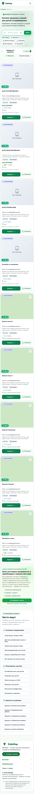

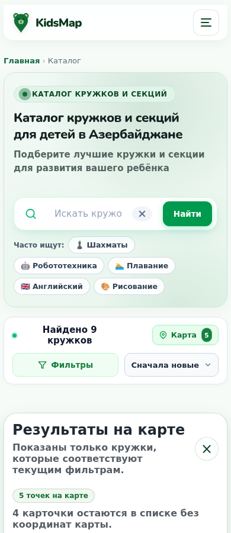

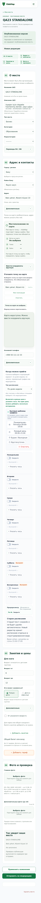

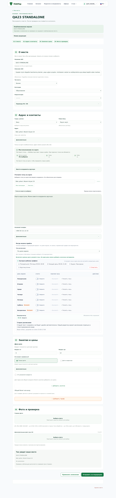

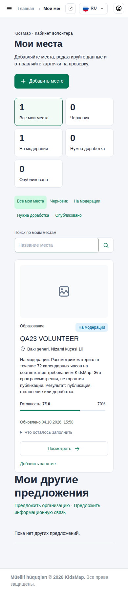

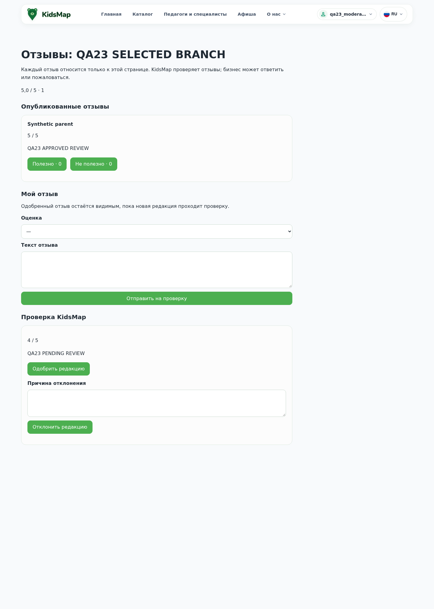

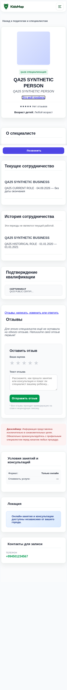

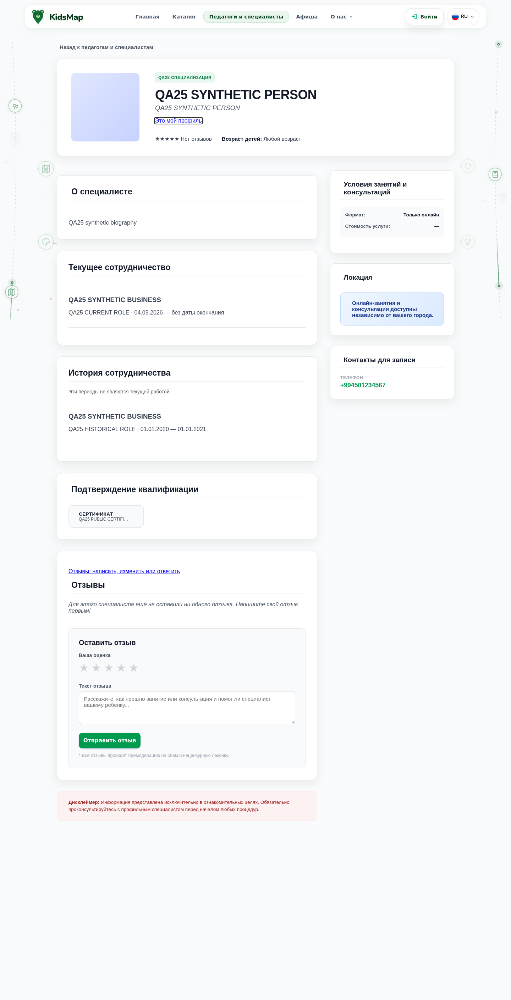

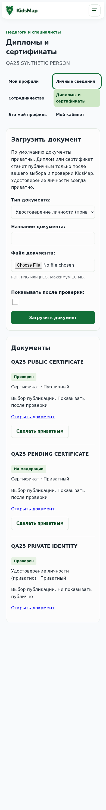

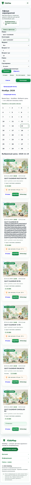

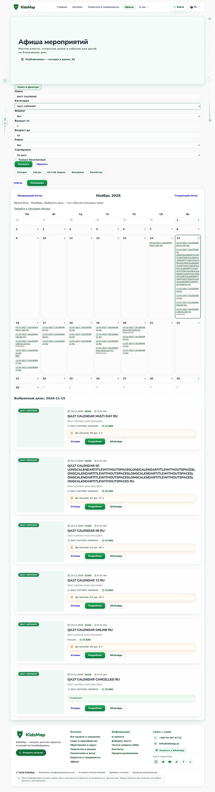

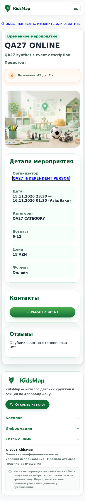

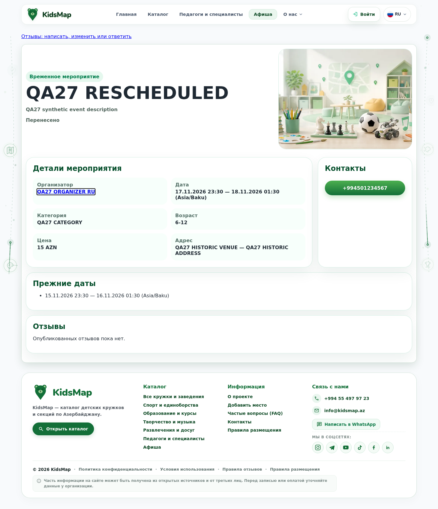

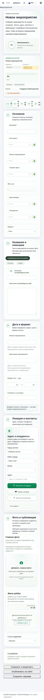

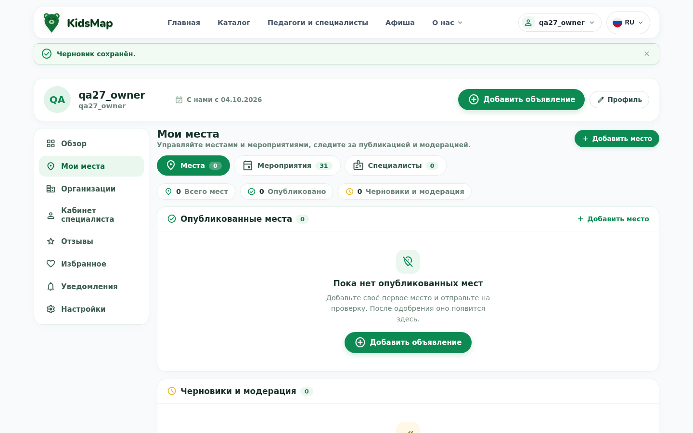

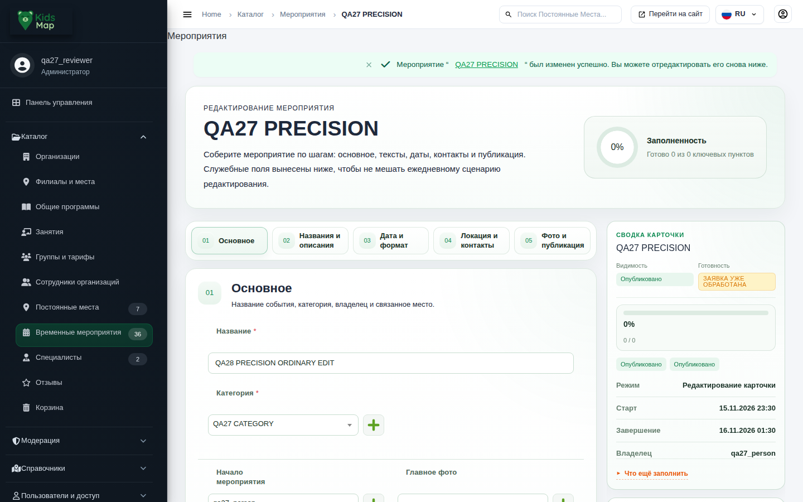

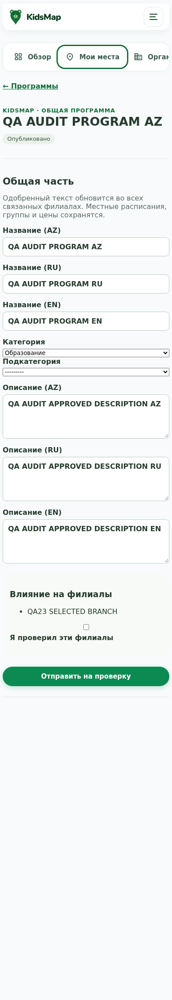

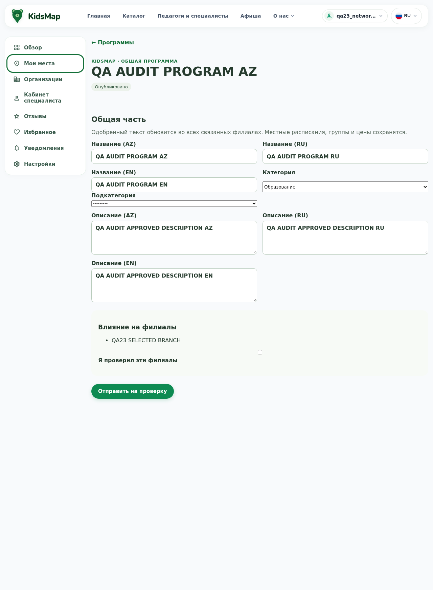

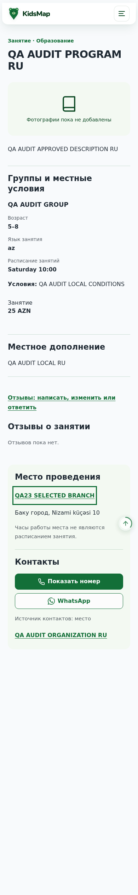

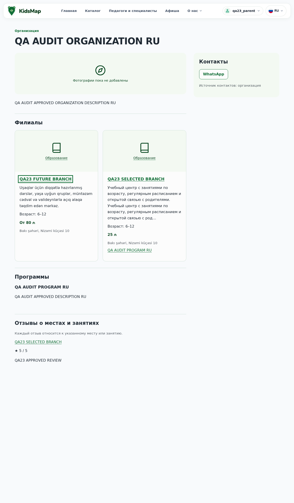

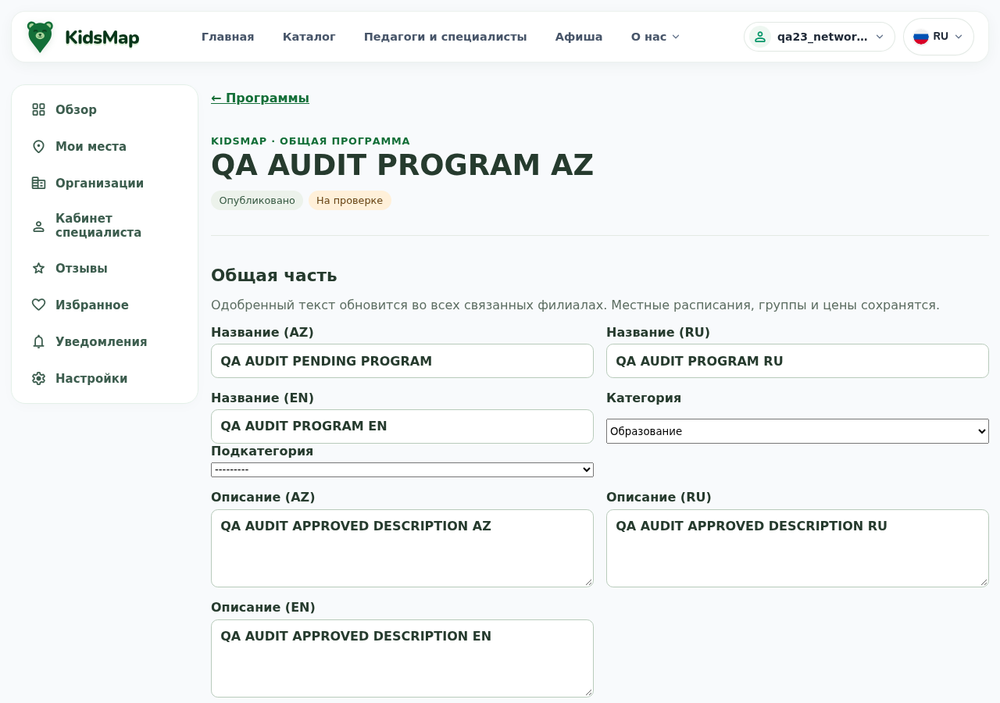

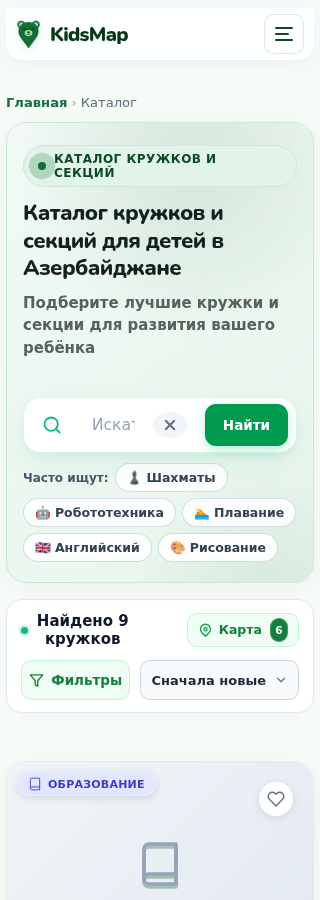

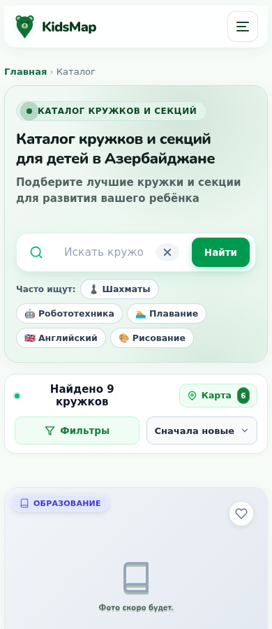

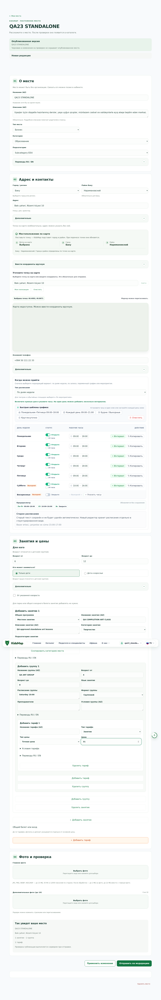

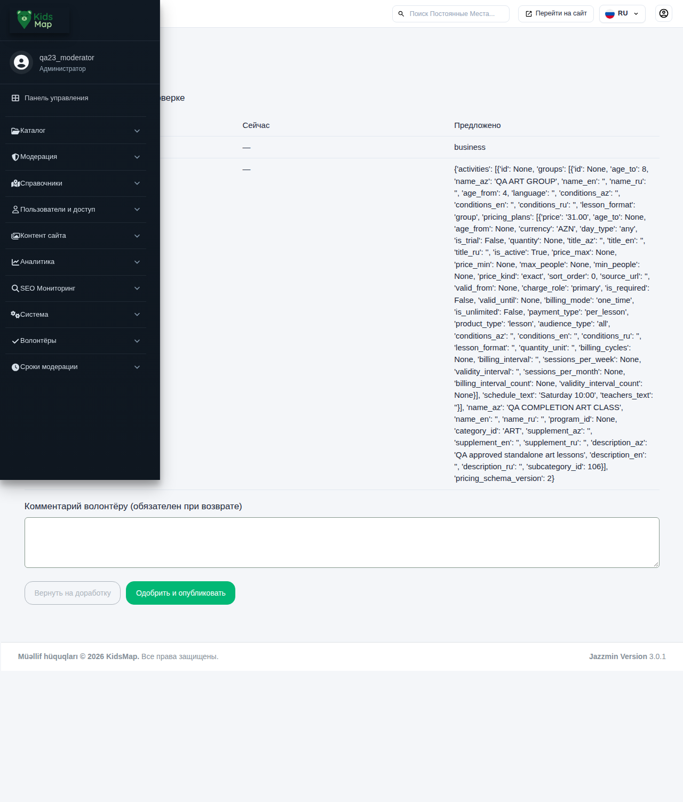

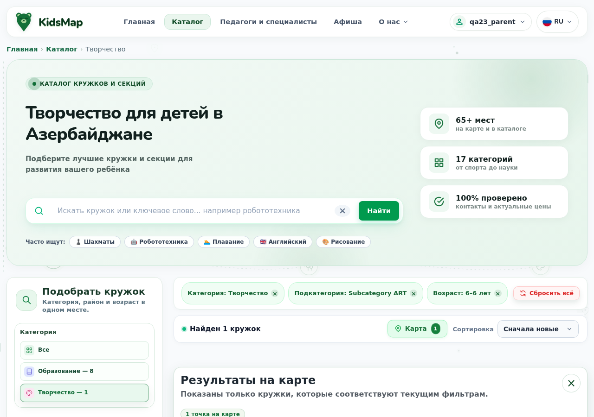

## Неудачные попытки и воспроизведение

История проверок сохранена. Первый полный host candidate: 1843, 2F/0E; исправлены две устаревшие admin-фикстуры и повторены полные сценарии. Более ранние owner/admin/public повторы хранят исходные ошибки. Mixed moderation имел отдельный RED до исправления. JS-all попытка ошибочно включила интеграционные browser-скрипты и выявила устаревший client-map контракт; затем отдельно выполнен корректный unit-набор.

Browser targeted c1/c2: ошибки маршрутов и синхронизации QA-адаптера; c3: 153 бизнес-проверки прошли, но реальный HTTP 500 оставил строгий FAIL. Targeted c4: новый полный повтор после исправления. Event c4: ошибочная попытка сохранить уже опубликованное событие; приложение правильно отказало. Event c5: те же проверки перевода перенесены до публикации, всё семейство выполнено заново. Recovery c1: отсутствующий экспорт QA bridge; c2/c3: текстовое представление SQL; c4: неверный расчёт корня QA reader; c5: прежний QA reader ожидал одно занятие вместо связанных и самостоятельных; c6: окончательный повтор. Ни одна неудачная попытка не переписана успешным результатом.

Изолированная среда: DJANGO_TESTING=1, PostgreSQL 17, отдельные БД/cache/media/locmem email, network-none контейнеры и guards transport/libpq, без production credentials. Полный набор внутри образа использует только SHA-проверенный read-only документ аналитики как дополнительный вход; application code не монтируется.

LOCAL HEAD `015d031d8eb17114bd860159dde805b38df3c13c`; dirty WORKTREE сохранён. Image `sha256:bb90c815dc2b7d19993a682ddfb117b832164b56ac412634650881c8e4d85c2a`. Artifact `r2-local-sha256-fb2b79949d6134a2790031ac9a9ab7753d33b71a81e334af805d5cbe1985c55c`; 2803 файлов. Старый образ и historical final-audit сохранены.

Команды ниже запущены из WSL Ubuntu-24.04; при повторе нужны новые уникальные stamp, чтобы не перезаписывать evidence. Полные raw-логи находятся в `/root/task33-evidence/completion-*`; в репозитории только безопасные результаты и синтетические скриншоты.

| Проверка | Команда |
|---|---|
| Host | python3 /mnt/c/kidsmap/docs/task33/completion/qa/backend.py --role domain --stamp full-host-final-c2 |
| Build | /root/kidsmap-task33/.venv/bin/python /mnt/c/kidsmap/docs/task33/completion/qa/build_artifact.py --stamp c2 |
| Image | python3 /mnt/c/kidsmap/docs/task33/completion/qa/image_suite.py --stamp c2 |
| Browser | python3 /mnt/c/kidsmap/docs/task33/completion/qa/browser_batch.py --stamp c4; после исправления порядка QA — bash browser_sync.sh и bash browser_run.sh event c5 из того же completion/qa |
| Recovery | python3 /mnt/c/kidsmap/docs/task33/completion/qa/domain_recovery_execute.py --stamp recovery-c6 --artifact <artifact.json из identity выше> |
| JS | node --test scripts/test_activity_taxonomy.cjs scripts/test_program_taxonomy.cjs scripts/test_phone_reveal.cjs scripts/test_photo_editor.cjs scripts/test_permanent_wizard_leave.cjs scripts/test_location_resolution.cjs scripts/tests/home_map_filters.test.cjs; KIDSMAP_JSDOM=C:/kidsmap/.tmp/phone-dom/node_modules/jsdom |

## Дорожная карта после этой приёмки

| Порядок | Состояние | Результат / дальнейшая работа |
|---|---|---|
| 1 → 2 → 3 → 4 → 5 | Завершены локально | Категории → конкурентные операции → интерфейсы → аварии уведомлений → общая регрессия. |
| 6. Эксплуатационная готовность | Отдельный согласуемый объём | Целевая конфигурация, реальные данные/миграция/recovery, секреты/доступы, мониторинг, worker schedule, внешние сервисы, нагрузка и план выпуска. |
| Production / commit / push / deploy | Не выполнялись | Текущий результат находится в сохранённом WORKTREE; запуск не разрешался этим планом. |
| Дополнительная проверка устройств | Не выполнялась | Физические iOS/Android, Safari/Firefox, полный screen-reader/contrast audit и реальные звонки. Это границы доказательств, а не утверждение об обнаруженном дефекте. |

[HTML с поиском и скриншотами](report.html)
