# Что получилось в KidsMap: проверка всех 28 этапов

Подробный аудит реализации, связей между функциями, тестов и готовности к дальнейшему запуску. Итог: основа работает, остаются подтверждённые ограничения и отдельный объём завершения.

## 1. Главный вывод простым языком

**Основная система реализована и её ключевые части связаны друг с другом. Окончательно считать всю задумку завершённой пока нельзя.** В этом аудите проверялось реальное поведение текущего приложения, а не только наличие отметок DONE.

Есть организация с филиалами и сотрудниками, занятия с группами и тарифами, проверка публикаций, каталог и карта, отдельные отзывы, специалисты с личными документами, события с календарём и историей. Семья получает публичные карточки и поиск; бизнес — кабинет управления; KidsMap — модерацию и контроль доступа.

Подтверждено функциональное ограничение: самостоятельному занятию нельзя задать собственную категорию через текущую форму. Оно может находиться по возрасту и исчезать при добавлении категории. У общей программы есть категория, но нет полноценного пути задания подкатегории. Следовательно, точный поиск по всем сочетаниям исходной задумки работает не для всех новых предложений.

Новый полный прогон выполнил 1817 тестов. Из 580 тестов Task33 прошли 579; конкурентный сценарий передачи владения остаётся нестабильным по ожидаемому результату. Прежние 580/580 относятся к предыдущему запуску и не подменяют этот результат.

Технический долг тестов также значителен: полный suite остаётся NOT_GREEN. Часть старых проверок требует поведения, которое было осознанно изменено; их нельзя ни игнорировать, ни делать зелёными ослаблением важных проверок. Полноценная эксплуатация на production в этот аудит не входила и не доказана.

### Ответы на основные вопросы

| Вопрос | Ответ |
|---|---|
| Все 28 этапов рассмотрены? | Да. Составлены 28 строк дорожной карты и отдельная сверка 306 требований. |
| Работают ли части вместе? | Основные проверенные связки работают. Ниже указаны фактические сценарии, ограничения поиска и непроверенные внешние связи. |
| Есть ли реальные скриншоты? | Да. Новые снимки отрендеренного приложения на синтетических локальных данных, с языком/шириной/источником и хешем. |
| Можно считать всё окончательно готовым? | Нет: остаются функциональная неполнота поиска, регрессионный долг, мелкие UI-дефекты и внешние эксплуатационные проверки. |
| Можно запускать production прямо сейчас? | Этот отчёт не даёт такого заключения. Нужны отдельные действия из раздела дорожной карты запуска. |

## 2. Что получилось: понятная модель продукта

Организация — необязательная общая оболочка бизнеса. Место может существовать самостоятельно. Программа описывает общую часть занятия, а конкретное предложение, группы и условия привязаны к месту. Такое разделение позволяет менять общую программу и сохранять местные отличия.

Новая правка опубликованной информации хранится отдельно до проверки. Посетитель продолжает видеть последнюю одобренную версию. Владение бизнесом, право редактирования и разрешение на публикацию — отдельные вещи.

### Сущности и их смысл

| Термин | На простом языке | Главная связь |
|---|---|---|
| Organization | Организация или сеть, даже без филиалов. | Сотрудники, общие контакты и программы. |
| Place | Отдельное место или филиал. | Может быть самостоятельным; связь с сетью не передаёт владение. |
| Program | Общая программа сети. | Применяется к выбранным филиалам с контролем влияния. |
| Activity / занятие | Конкретное предложение в конкретном месте. | Может основываться на программе; имеет группы и свои условия. |
| Group | Группа по возрасту, уровню, языку и расписанию. | Поиск должен сопоставлять условия внутри одной реальной группы. |
| Tariff | Цена и понятные условия оплаты. | Одна группа, набор групп или общий вход в место. Несопоставимые цены не сводятся в ложный бюджетный фильтр. |
| Specialist | Профиль отдельного человека. | Claim подтверждает KidsMap; организация не становится владельцем личности. |
| Event | Одно конкретное проведение события. | Один организатор, отдельная площадка, точное время Баку, отмена/перенос с историей. |
| Review / revision | Отзыв и его редакции. | Публична одобренная версия; бизнес отвечает или жалуется, а не модерирует чужой отзыв. |
| Outbox | Надёжная очередь служебных сообщений. | Изменение сохраняется даже при сбое отправки письма; повтор не должен дублировать сообщение. |

### Путь бизнеса к публичному каталогу

Создать место / организацию → Настроить сотрудников и программу → Добавить занятие, группы и тарифы → Отправить изменения на проверку → KidsMap одобряет актуальную версию → Семья видит карточку, поиск и карту

### Путь специалиста и события

Подтвердить профиль человека → Подтвердить связи с организациями отдельно → Выбрать и проверить публичные сертификаты → Назначить организатора события → Опубликовать проведение в афише → Сохранить историю отмены или переноса

## 3. Как проводилась проверка и что означает evidence

Ведущая роль: kidsmap-orchestrator, исполнитель /root; каноническое определение `.agents/agents/kidsmap-orchestrator/agent.md`. Область: локальный аудит всех 28 этапов; production UNKNOWN / NOT_CONTACTED. Реализация новых функций не входила в поручение.

Дата отчёта —4 октября 2026, Asia/Baku. Checkout C:/kidsmap, branchtask33-progress, LOCAL HEAD `015d031d8eb17114bd860159dde805b38df3c13c`. Проверялся dirty WORKTREE, а не один коммит. До начала сохранены 545 файлов и binary patch;218 прежних source hashes совпали.

Application source и существующие assertions не исправлялись. Новый код аудита — отдельные диагностические fixtures, collectors и оформление отчёта. Production не подключался. Тесты работали с DJANGO_TESTING=1, отдельными PostgreSQL/media/cache/email, запретом внешнего транспорта и проверкой принадлежности контейнеров перед очисткой.

Выполнены свежие full suites в host и точном локальном image, browser-матрицы, независимые проверки безопасности, целевое воспроизведение спорных контрактов, повтор native recovery, проверка static/Compose/image и дополнительные JS-тесты. Диагностический PASS иногда означает успешное воспроизведение ограничения — это явно указано.

Codebase Memory использован для архитектурной навигации. Начальный root snapshot имел index generation2026-10-03T21:35:01Z; поздняя проверка Django reviewer — generation2026-10-04T08:49:58Z. Это разные снимки индекса. Для важных services/forms наблюдались metadata_changed и coverage_unavailable, deploy исключён, часть templates разобрана неполно. Выводы сверялись по исходникам; граф не считается полным доказательством.

Три специалиста работали в разных областях: Django/requirements, browser и security→release; root выполнял host full, первый image full, native recovery и сводил результаты. Исправленный повтор image full выполнил security/release reviewer. Переключение ролей одного исполнителя не делает их независимыми людьми. Предыдущее авторство backend27 и release override раскрыто в reviewer reports.

### Тип доказательства

| Метка | Что она означает |
|---|---|
| Fresh execution | Команда или browser-сценарий выполнен заново в этом аудите; есть результат и snapshot. |
| Source verified | Прочитана фактическая реализация и её связи; это не заменяет runtime. |
| Retained same-source | Ранее выполненный тест относится к тем же байтам, но повтор не запускался; это указано отдельно. |
| Partial / gap | Часть обещания работает, часть отсутствует или не доказана. |
| Not run / external | Реальный внешний сервис, production-данные или эксплуатационный процесс здесь не проверены. |

## 4. Дорожная карта всех 28 этапов: обещание и результат

Ниже — последовательность реализации и зависимости. Статусы описывают результат аудита, а не механически повторяют DONE из журнала. Этапы 01–03 включают документы и принятие макетов; это предварительные условия, а не отдельные production-функции.

[Подробная сверка требований](REQUIREMENTS.md) сохраняет все 306 пунктов. [Domain review](domain-review.md) содержит source/test ссылки и объяснения ограничений.

### Матрица 28 этапов

| № | Этап | Что обещали | Что получилось | Статус аудита | Зависимости | Ограничения / остаток |
|---|---|---|---|---|---|---|
| 01 | Документы и пакет заданий | Согласовать границы и очередь 28 работ | Пакет заданий, решения D01–D15 и журнал задают последовательность. Исторические согласования сохраняются. | Исторически принято; свежая проверка отдельно |  | Историческое согласование нельзя повторно доказать текущим backend тестом. |
| 02 | Макеты создания и кабинета | Согласовать вид каталога и кабинета | Принятые макеты служат входом реализации; текущие шаблоны проверяет отдельный browser reviewer. | Исторически принято; свежая проверка отдельно | 1 | Согласование макета и совпадение живого интерфейса — разные доказательства. |
| 03 | Макеты админки и публичного сайта | Согласовать вид админки и проверки предложений | Единый admin shell и review workflow реализованы позже в 15–16. | Исторически принято; свежая проверка отдельно | 1; 2 | Текущий визуальный результат относится к browser report, а не к source review. |
| 04 | Изолированная среда и baseline | Зафиксировать безопасный исходный baseline | QA04 создаёт отдельный PostgreSQL/cache/media/email и проверяет сеть/libpq; исходные assertions сохранены. | Исторически принято; свежая проверка отдельно | 1 | Baseline исторический; итоговый полный suite по-прежнему содержит ошибки и не объявляется зелёным. |
| 05 | Совместимая схема каталога | Добавить структуру без потери прежних мест | Org→Program и Place→Activity→Group добавлены рядом с Place; FK, версии и запрет каскадной потери поддерживают сохранение личности карточки. | Частично подтверждено; см. ограничения | 1; 4 | Часть межстрочных условий защищена сервисом/ORM, а не SQL trigger; bulk/raw writes не равнозначны нормальному save. |
| 06 | Владение и принадлежность организации | Отделить управление от принадлежности к сети | Claim не публикует; join требует обе стороны; transfer отзывает прежние grants; detach сохраняет утверждённые местные данные. | Частично подтверждено; см. ограничения | 5 | Синтетическое владение не доказывает юридическое владение реальным бизнесом. |
| 07 | Сотрудники и разрешения | Дать команде ограниченные полномочия | Business team grants и selected/all_network проверяются заново на сохранении; Program edit отделён от Place edit. | Частично подтверждено; см. ограничения | 6 | Source ACL не заменяет проверку всех прямых URL; независимый security report закрывает свою матрицу. |
| 08 | Публикации и редакции | Сохранять публичную версию при проверке правки | Один publication pipeline хранит patch/schema/base/version и проверяет свежие зависимости; цена/расписание имеют явные узкие immediate paths. | Частично подтверждено; см. ограничения | 7 | Старые payload без signed version и прежние обязательные фото/coords не соответствуют принятому контракту; каждое падение требует отдельного разбора. |
| 09 | Серверные черновики и автосохранение | Восстанавливать незавершённую работу без публикации | ServerDraft имеет actor/object/schema/source/version; приватные фото не становятся public автоматически; create материализуется один раз. | Частично подтверждено; см. ограничения | 8 | Offline/reload/device UX отдельно от HTTP shape; nested working copy проверяется при final form, не полностью на autosave. |
| 10 | Тарифы и совместимость | Сохранить тарифы и правильно назвать итоговую цену | PricingPlan XOR place/group, scope IDs, versioned nested writer и единый summary; trial не превращает платное занятие в бесплатное. | Частично подтверждено; см. ограничения | 9 | Все consumers/CSV/JSON нельзя считать проверенными одним round-trip; соответствующие test cases и browser evidence должны сопоставляться отдельно. |
| 11 | Инструмент переноса | Переносить данные явно, повторяемо и без догадок | Ledger/fingerprint/checkpoint и атомарные пакеты; unknown очередь manual review; dry-run не сохраняет модель. | Частично подтверждено; см. ограничения | 10 | Репетиция синтетическая; реальный состав production UNKNOWN. Мой прежний DB отчёт не является независимым self-review. |
| 12 | Кабинет организаций | Дать владельцу понятный кабинет организации | Organization workspace использует общий navigation, ownership services и scoped team; Org может быть без филиалов. | Частично подтверждено; см. ограничения | 11 | Backend route tests не доказывают focus/responsive/accepted design; отдельная fresh browser matrix. |
| 13 | Новая форма места | Создавать место одной непрерывной формой | Owner form continuous mode с четырьмя разделами, draft transport и явным submit; standalone без Org допустим. | Частично подтверждено; см. ограничения | 12 | Пробел standalone taxonomy проявляется после создания занятия: category+age не находит новый объект;14/19. |
| 14 | Программы и группы | Разделить общую программу и местные группы | Program editor имеет отдельное право/impact confirmation; approved snapshot общей части и local supplement, группы и тарифы сохраняются. | Частично подтверждено; см. ограничения | 13 | Частично: standalone writer не задаёт category; Program writer задаёт category, но не subcategory. D04 не обещает отдельное поле subcategory Program, однако 19 обещает комбинированный поиск. |
| 15 | Административные редакторы | Редактировать новую структуру в общей админке | Domain admin отделяет draft/submit/approve/unpublish и скрытые carryover values; версия обязательна для снятия публикации. | Частично подтверждено; см. ограничения | 14 | Admin legacy suite не зелёный: два причинных probes объясняют старые expectations; остальные failures не списываются группой. |
| 16 | Модерация и волонтёры | Проверять предложения в одном hub | Volunteer предложение остаётся отдельным от владения; review показывает current/candidate, version/impact и counters. | Частично подтверждено; см. ограничения | 15 | Все GET/POST/AJAX substitution сценарии требуют точной security matrix; UI focus/diff — browser scope. |
| 17 | Служебные уведомления | Сохранять уведомление даже при сбое почты | Transactional inbox/outbox, event/entity/version/recipient dedupe, свежие права и bounded retry; runner не настраивает production cron. | Частично подтверждено; см. ограничения | 16 | PARTIAL17-03: SMTP success перед DB commit оставляет crash window для повторной физической отправки. Тест normal retry не доказывает exactly-once mail; внешний SMTP NOT_RUN. |
| 18 | Публичные страницы | Показать честные страницы организации, места и занятия | Public resolver берёт только approved/current, местные overrides и свежую связь; Org без общего рейтинга; detach отключает inherited contacts. | Частично подтверждено; см. ограничения | 17 | Новые browser Org/Activity contexts выполняет другой reviewer; ORM display fixture не выдаётся за end-to-end publication. |
| 19 | Точный поиск и карточки | Находить место по одному подходящему занятию | matching_groups делает conjunction в одной Group, дедуплицирует Place, matched prices отдельно; legacy unknown не получает ложного exact match. | Частично подтверждено; см. ограничения | 18 | CONFIRMED P2: реальные новые standalone занятия находятся по возрасту, но теряются при category+age. Subcategory reader работает лишь при готовом snapshot, которого текущие writers не создают. Passing reader fixtures внедряют snapshot напрямую. |
| 20 | Карта и общие площадки | Показать одну площадку с независимыми бизнесами | Map payload группирует только confirmed venue, применяет те же filters; no coords остаётся в list, близость не создаёт Org. | Частично подтверждено; см. ограничения | 19 | Maps transport stubs не доказывают внешний provider; source payload не является rendered popup keyboard evidence. |
| 21 | Локализация, URL и SEO | Сохранить языки, адреса страниц и честную индексацию | AZ fallback маркируется, canonical/hreflang/sitemap по содержательному переводу; старые Place IDs/paths и typed JSON-LD. | Частично подтверждено; см. ограничения | 20 | Timezone lastmod legacy assertion имеет UTC/local disagreement; отдельно классифицировано, не blanket regression. Search product gap влияет и на обнаружение карточек. |
| 22 | Отзывы и версии реакций | Сохранить историю отзывов и один видимый вклад | Typed heads/revisions Place/Activity/Specialist/Event; current approved сохраняется при pending, reactions привязаны к revision, unknown authors не объединяются. | Частично подтверждено; см. ограничения | 21 | Compatibility trusted legacy save — отдельный путь; historical migration + deletion hooks надо оценивать вместе. Org не имеет общего балла. |
| 23 | Репетиция и приёмка R1 | Подготовить локальный R1 с сохранением новых данных | R1 cohort fail-closed и конверсия/recovery package; synthetic fixtures не реальные участники пилота. | Исторически принято; свежая проверка отдельно | 22 | Исторический R1 snapshot не итоговый R2 PASS. Прежняя моя DB работа не независимый повторный аудит. Реальный пилот/production запуск NOT_RUN. |
| 24 | Основа специалистов | Проверить личность специалиста и приватные документы | KidsMap claim назначает аккаунт человека; employment bilateral/history; identity evidence private, certificate approved+person opt-in. | Частично подтверждено; см. ограничения | 23 | Не существует автоматического доказательства личности; private production media transition остаётся отдельной операцией. Upload suffix/size не равно полному MIME анализу. |
| 25 | Интерфейсы специалистов | Дать человеку и организации разные экраны специалиста | Person workspace, claim/employment/certificate flows; Org не получает biography/docs через Place ACL. | Частично подтверждено; см. ограничения | 24 | Public certificate требует всех текущих условий одновременно. История и private practice не должны выглядеть текущей работой; fresh browser evidence отдельно. |
| 26 | Основа событий | Дать событию своего организатора и неизменную историю | Один Org или verified Specialist организатор, venue отдельно; aware Baku интервалы, snapshot при approval, cancellation/reschedule append history. | Частично подтверждено; см. ограничения | 25 | V3 precision fix сохраняет секунды лишь для неизменившегося отображённого времени, изменение минуты остаётся защищено. История сервисная/ORM, не неуязвимый raw SQL audit log. |
| 27 | Афиша и календарь | Показывать один список и полный календарь событий | List/calendar используют общие query filters и Baku half-open boundaries; month не ограничен list pagination; реальные Event IDs без generated occurrences. | Частично подтверждено; см. ограничения | 26 | Accepted preservation q делает прежний calendar assertion устаревшим. Keyboard/responsive фактически проверяет browser reviewer, feature flag production off. |
| 28 | Итоговая приёмка R2 | Подготовить проверяемый локальный R2 без запуска production | Exact V3 archive/image/source/schema/media/cohort, frozen compatible reader и native restore с новыми данными; root повторяет полный suite и роли. | Частично подтверждено; см. ограничения | 27 | NOT GREEN full suite, P2 taxonomy product gap, external OAuth/Maps/SMTP/pilot NOT_RUN. Локальная проверка не разрешает production. Авторство прежнего DB/image followup раскрыто. |

## 5. Проверка совместной работы

Проверялись как положительные действия, так и запреты: изменение чужого объекта, устаревшая версия, права прежнего владельца, непроверенная публикация, приватный документ и чужая площадка события. Наличие кнопки в интерфейсе не принималось за доказательство серверного права.

Для новых диагностических сценариев использовались реальные services/writers там, где это возможно. Одобренные данные дополнительных browser-экранов подготовлены как синтетические fixtures: это проверка отображения и последующих действий, а не доказательство всего пути от регистрации до первой публикации.

### Сквозные связи

| Связка этапов | Что проверяли | Результат и граница |
|---|---|---|
| 06–07–12–13 | Организация, филиал, выбранные права, будущие филиалы, отделение и передача владения. | Положительные/отрицательные контракты и browser scope проверены. Конкурентный transfer-test воспроизводимо требует уточнения ожидания при безопасном отказе. |
| 08–09–14–15–18 | Черновик → candidate → модерация → публичная одобренная версия. | Версии и сохранность current проверяются suites и дополнительным Program edit/stale conflict сценарием. |
| 10–14–18–19–20 | Программа/занятие → группа/тариф → поиск → карта. | Главная выявленная неполнота: standalone taxonomy и writer подкатегории. Отдельно измерены query counts и честность no-coordinates поведения. |
| 16–17 | Модератор/волонтёр → решения → уведомления. | Права, статусы, durable outbox/retry/dedupe проверены локально. Реальная SMTP-доставка и расписание runner не доказаны. |
| 21–22 | Язык, видимость, отзывы и редакции. | AZ/RU/EN UI, provenance/fallback и typed reviews проверены. Часть локализационной полировки остаётся. |
| 24–25–06–07 | Claim человека → employment → права организации → документы. | Подтверждения и доступ разделены; приватные сведения не превращаются в имущество организации. |
| 26–27–24–22 | Организатор/площадка → событие → афиша → отзыв/история. | Права организатора, online без фиктивной географии, календарь, отмены/переносы и точность времени проверены. |
| 11–23–28 | Преобразование данных → выключение новых записей → восстановление после новых данных. | Свежая native rehearsal сохранила 98 таблиц,25 публичных и 2 приватных файла, новые записи/историю/outbox. Production объём не проверялся. |

## 6. Фактические результаты тестов

Full-suite failures/errors — записи результата unittest; несколько subtest-проблем могут относиться к одному test ID. Поэтому проценты успешности из простого вычитания этих чисел не рассчитываются.

Browser PASS означает, что прошли перечисленные автоматические проверки сценариев. Он не отменяет замечаний ручного визуального и DOM-аудита: None, перевод сообщения, обрезанный счётчик и вложенные основные области страницы перечислены отдельно.

В новом host прогоне 108 problem IDs сохранились относительно 28; один прошлый sitemap-test прошёл утром, а ownership-race впервые упал в полном наборе этого запуска. Это согласуется с зависимостью sitemap expectation от UTC/Baku границы дня и concurrency expectation от порядка потоков. Остальные метки baseline использованы как указатели для проверки причин, а не как автоматическое оправдание.

Безусловный PASS всего приложения не получен. Успешное воспроизведение диагностического probe не является исправлением найденного ограничения. Application assertions не менялись.

Первый image-full запуск: 1817 тестов, 125 failures и 28 errors; Task33 548/580. Его дополнительные ошибки включали несовместимое расположение тестового сокета и временных файлов. Эти результаты сохранены отдельно; для итогового повтора исправлялось только окружение QA, без добавления отсутствующих application-файлов. Причины и различия: [image-full-comparison.json](image-full-comparison.json).

Исправленный повтор в том же образе: 1817 тестов, 108 failures и 12 errors; Task33 580/580. С host совпадают 108 problem IDs без смены типа ошибки. Только в образе падает проверка наличия документа analytics-event-taxonomy.md: runtime-пакет намеренно не включает docs/product. Это несовместимость состава пакета с документным тестом, а не доказанная неисправность публичного сайта. Host-only ownership race в образе прошёл; его нестабильность остаётся незакрытой. Первоначальный единичный сбой rating calibration в повторе не появился, точная причина первого сбоя не доказана.

Это группировка записей ошибок, а не число независимых дефектов. Точные assertion, subtest, причина, уверенность и границы каждого случая сохранены в [domain-failure-classification.json](domain-failure-classification.json). Разбор первого отказа не доказывает успешность последующих действий того же теста.

### Все основные новые запуски

| Проверка | Результат | Evidence |
|---|---|---|
| Полный PostgreSQL suite, host Python3.12.3 | 1817 выполнено; 109 failures, 11 errors, 0 skipped | [full-results.json](full-results.json) |
| Task33 внутри host full | 579/580 без failed ID; остальные — в failure_review | В этом запуске ownership concurrency failed; прежние 580/580 не подставлены. |
| Полный PostgreSQL suite внутри точного image Python3.12.15 | 1817 выполнено; 108 failures, 12 errors, 0 skipped | [image-full-r2-results.json](image-full-r2-results.json); Task33580/580 |
| Independent security selected260 | 260 выполнено; 1 failures, 0 errors, 0 skipped | [security-results.json](security-results.json) |
| Дополнительные auth/upload/redirect negatives | 12 выполнено; 0 failures, 0 errors, 0 skipped | [security-supplement.json](security-supplement.json) |
| Concurrency causal: original5 + forced ordering | 6 выполнено; 0 failures, 0 errors, 0 skipped | [security-causal.json](security-causal.json); отдельный PASS не отменяет failed260. |
| Воспроизведения поиска, отображения и старых admin-контрактов | 6 выполнено; 0 failures, 0 errors, 0 skipped | [domain-results.json](domain-results.json); PASS означает подтверждение наблюдаемой причины, в том числе пробела поиска. |
| Rendered browser | FAIL; 816 контекстов; 1724/1724 проверок | [browser-results.json](browser-results.json), [browser-review.md](browser-review.md); функциональные assertions и ошибки браузера учтены отдельно. |
| Отдельное воспроизведение ошибки перехода Program | 2/2 бизнес-проверки; 2 ошибки ViewTransition при ответе 400 и перенаправлении после сохранения | [browser-motion-results.json](browser-motion-results.json); не включено повторно в 816 контекстов. |
| Native recovery | 98 таблиц; 25 public + 2 private files совпали | [recovery-results.json](recovery-results.json) |
| JS DOM contracts | 10/11; 1 failure | [javascript-results.json](javascript-results.json); старый CSS-marker, отдельный causal2;1 case uses retained HTML. |
| JS analytics attribution logic | PASS, отдельный Node script | Логика распознавания источника; реальная GA4-доставка NOT_RUN. |
| Image / Compose / static | 2794 image files MATCH; required config negatives3/3; static9305 MATCH | [security-image.json](security-image.json), [security-compose.json](security-compose.json), [security-static.json](security-static.json) |

### Разбор 120 записей проблем host full

| Группа причин | Записей |
|---|---|
| Причина первого отказа разобрана по исходнику; полнота сценария отдельно | 105 |
| Причина подтверждена отдельным воспроизведением | 5 |
| Причина или последующие части сценария ещё не доказаны | 8 |
| Подтверждено увеличение числа запросов | 1 |
| Упавший конкурентный сценарий требует закрепления допустимых исходов | 1 |

## 7. Сильные стороны и реальные ограничения

Сильная сторона системы — разделение прав и публичных данных: владелец площадки не управляет чужим событием; организация не получает личность специалиста; бизнес не модерирует чужие отзывы; неопубликованные правки не должны подменять текущую одобренную карточку.

Вторая сильная сторона — сохранность данных при изменениях: история событий и документов, прошлые редакции и реакции, snapshot после отделения от сети, durable outbox и проверенное восстановление после новых записей. Это подтверждено конкретными локальными сценариями, а не предполагается по названиям моделей.

### Проблемы и долг

| Приоритет | Проблема | Что видит пользователь / эффект | Следующий шаг |
|---|---|---|---|
| P2 · функциональность | Нет полноценного taxonomy writer для standalone Activity; Program subcategory путь отсутствует. | Часть новых занятий пропадает при сочетании категории/подкатегории с возрастом. | Согласовать модель и writer, затем проверить создание → approval → поиск/карта на одинаковом предложении. |
| P2 · качество регрессии | Полный backend suite остаётся NOT_GREEN. | Нет надёжного общего сигнала, что изменение безопасно для всей системы. | Разобрать каждый failed ID; обновить obsolete fixtures/assertions по принятым контрактам и устранить реальные дефекты, сохраняя negative checks. |
| P2 · concurrency test contract | Тест требует завершённого transfer даже при допустимом отказе «структура изменилась». | Пользователь может получить просьбу обновить данные; проверка то проходит, то падает. | Явно закрепить допустимые исходы и UX повторной операции, проверить отсутствие stale rights для каждого исхода. |
| P3 · непроверенный аварийный сценарий | Письмо отправлено, но процесс упал до фиксации доставки в БД. | Повтор после такого сбоя потенциально отправит письмо повторно; обычный retry/dedupe не доказывает ровно одну доставку. | Проверить управляемый сбой между SMTP и commit; согласовать гарантию доставки и защиту от дублей. Внешний SMTP в аудит не входил. |
| P3 · тестовая поддержка | Старый JS-тест ожидает compact CSS-marker на generic detail call link. | Телефонная ссылка/focus/cache проходят probe; старый тест всё равно красный. | Привести fixture/assertion к фактическому типу кнопки, сохранив проверку поведения. |
| P3 · интерфейс | При неизвестном стаже специалиста выводится None. | Родитель видит техническое слово вместо понятного отсутствующего значения. | Показать «стаж не указан» либо не выводить строку; проверить AZ/RU/EN. |
| P3 · локализация | Сообщение об успешном сохранении события на RU-странице остаётся на AZ. | Владелец сохраняет черновик, но получает ответ на другом языке. | Дополнить перевод и повторить native save на трёх языках; остальные наблюдения см. browser-findings.json. |
| Gate · эксплуатация | Реальные интеграции, production data/private storage/cohort/monitoring не проверены. | Локальная корректность ещё не гарантирует безопасную работу действующего сайта. | Выполнить отдельную подготовку запуска по release-gates.json. |

### Подтверждённые наблюдения браузерного аудита

| ID / приоритет | Что наблюдалось | Источник / доказательство | Ответственный |
|---|---|---|---|
| FA-BROWSER-01 / P3 | Если стаж не указан, родитель видит техническое слово None вместо понятного сообщения. | src/catalog/templates/catalog/specialist_detail.html:79; /root/task33-evidence/browser28-specialist-finalaudit-20261004-specialist/public-ru-390.png | frontend-reviewer |
| FA-BROWSER-02 / P3 | После успешного сохранения черновика русскоязычный владелец получает сообщение на азербайджанском. | src/catalog/controllers/owner_events_controller.py:67; /root/task33-evidence/browser28-event-finalaudit-20261004-event/owner-precision-after-edit.png | django-reviewer/frontend-reviewer |
| FA-BROWSER-03 / P3 | На узком экране часть надписи о числе результатов обрезана. Ошибка в русском склонении не подтверждена: исходный текст корректный. | static/css/pages/catalog_places.css:724; src/catalog/templates/catalog/place_list.html:553; screenshots/26-targeted-catalog-count-ru-320.png; screenshots/27-targeted-catalog-count-ru-390.png | frontend-reviewer |
| FA-BROWSER-04 / P3 | Редактор программы создаёт две основные области страницы. Это может затруднять навигацию по областям для пользователя вспомогательных технологий. | src/catalog/templates/base.html:134; src/catalog/templates/pages/program_editor.html:4; /root/task33-evidence/browser28-targeted-finalaudit-20261004-targeted3/results.json rows.Program.visible_main_landmarks=2 | frontend-reviewer |
| FA-BROWSER-05 / P3 | Форма правильно проверяет подтверждение филиала и сохраняет изменение, но браузер сообщает об ошибке анимации перехода. Поэтому строгий браузерный аудит не прошёл полностью. | static/css/motion.css:143 (global navigation:auto); src/catalog/templates/pages/program_editor.html lacks scoped navigation:none; precise native internal promise attribution not proved; browser-motion-results.json; targeted3/results.json pageerror1 | frontend-reviewer/browser-qa |

## 8. Производительность, данные и выпуск

На свежем host control comparison одна карточка: 6→8 SQL-запросов и 0.107488→0.11106s. Восемь карточек: 41→8 запросов и 0.206756→0.329205s. Сокращение запросов подтверждено, ускорение именно этого замера не подтвердилось.

Измерения выполнялись одновременно с другими QA-процессами и не являются изолированным нагрузочным тестом. Native20/200-row comparison также сохранён в recovery-results. Производительность реального объёма данных, p95/p99 и пределы инфраструктуры остаются отдельной задачей.

Точный LOCAL image `sha256:6566a67c0b3ab3da8ea040314b016908b1cbe17e09a50912fc5c80fe5228f5fd`; artifact `r2-local-sha256-65d8995ff21fb5e5b9fb88d81d18f2f36c4380841f14131cd11dc258bf8c61b2`. Свежие проверки подтвердили 2794 файлов и 9305 static файлов. Полный suite теперь действительно запущен внутри этого image; его результат приведён выше.

Private-media bind, явный cohort default-off и build context должны входить в эффективную конфигурацию запуска. Проверенный override не применялся к production. Native recovery использует совместимый frozen reader на host Python3.12.3; image-based native recovery под Gunicorn и реальная off-host production restore здесь не исполнялись.

Удаление legacy-кода или схемы не рекомендуется на основании этого аудита. Совместимые readers, старые IDs/URLs, version history и migration markers используются для сохранности данных. Наличие старого теста или bridge не доказывает, что соответствующий путь мёртв.

## 9. Дорожная карта оставшейся работы

Это порядок действий, а не обещание сроков. Сначала закрываются функциональные и регрессионные вопросы, затем эксплуатационные. Исправления приложения и production запуск требуют отдельного согласованного объёма.

### Что делать дальше

| Очередь | Работа | Зависит от | Критерий завершения | Владелец |
|---|---|---|---|---|
| 1 | Уточнить taxonomy самостоятельных занятий и программ. | Продуктовое решение: где задаётся категория/подкатегория и как наследуется. | Созданное через UI предложение находится по всем согласованным фильтрам; карта/каталог согласованы; нет чужих matches. | Django + frontend + integration |
| 2 | Закрыть красную регрессию по списку конкретных IDs. | Согласованные contracts01–28, causal evidence этого отчёта. | Полный explicit suite зелёный на host и image; старые meaningful negative проверки сохранены. | Integration + владельцы доменов |
| 3 | Уточнить конкурентную передачу владения и повтор операции. | Допустимые исходы при одновременном join/transfer. | Детерминированные tests обоих порядков; пользователь получает понятный результат; прежние права отозваны после commit. | Django + security |
| 4 | Исправить подтверждённые UI тексты, обрезание, разметку и переходы. | Скриншоты, browser findings и воспроизведение Program POST400/302. | AZ/RU/EN: без None, неверного языка, обрезанного счётчика, лишнего main и ошибок перехода; расширить дополнительные Program/Activity/Organization проверки с двух ширин до семи. | Frontend + browser QA |
| 5 | Подготовить эксплуатационные условия. | Точный image/config, ownership/private-media/cohort. | Сверены настоящие data/schema/media, доставка SMTP/runner, OAuth/Maps, TLS и monitoring; фактические limits определены. | Release + security + database |
| 6 | Провести rehearsal на согласованном staging/копии production. | Предыдущие пункты и безопасный набор данных. | Полный набор проверок + migration/reconciliation + off-host restore после новых записей + stop criteria. | Integration + release + database |
| 7 | Отдельно разрешённый ограниченный запуск. | Решение владельца и подтверждённые release gates. | Явный cohort, наблюдение метрик/ошибок, возможность остановить новые writes без потери истории. | Владелец продукта + release |

## 10. Реальные скриншоты

Это снимки нового browser-прогона приложения на локальных синтетических fixtures. Макеты этапов 02/03 не выданы за работающие экраны. Галерея показывает верхнюю часть длинного снимка; нажмите её, чтобы открыть полный оригинал. Подробные context/URL/locale/width/source hashes находятся в [индексе](screenshots/index.json).

Скриншот доказывает внешний вид конкретного состояния. Серверные права и сохранность данных подтверждаются отдельными POST/negative/DB проверками; невидимая кнопка сама по себе не доказывает запрет.

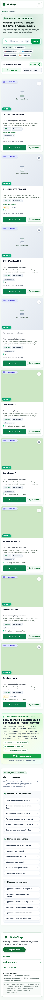

Каталог для родителя. Публичные фильтры и результаты · ru · 390px

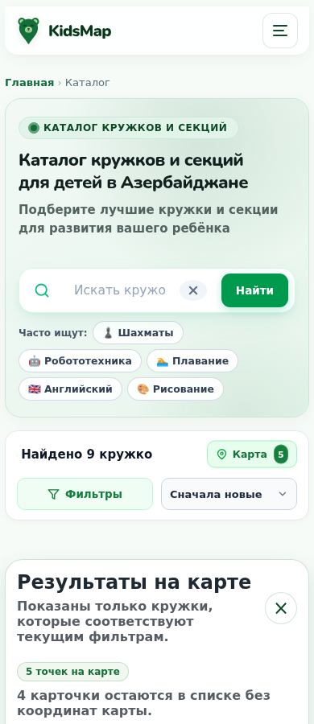

Карта каталога. Реальная локальная карта: известные точки и записи без координат · ru · 390px

Форма владельца. Мобильное редактирование самостоятельного места · ru · 390px

Форма владельца — большой экран. Непрерывные секции редактирования · ru · 1440px

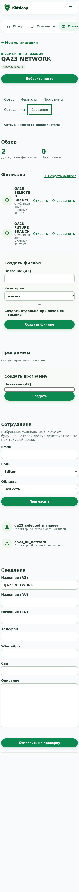

Организация владельца. Доступные филиалы и горизонтальная навигация · ru · 390px

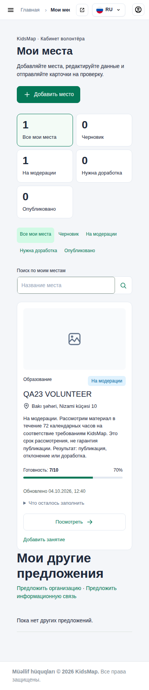

Кабинет волонтёра. Очередь предложенных изменений · ru · 390px

Отзывы для модератора. Одобренный отзыв и отдельный кандидат · ru · 1440px

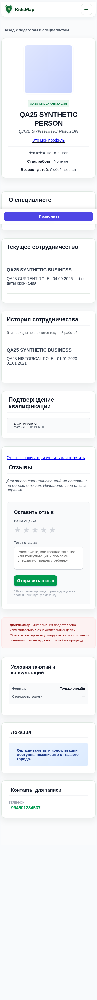

Публичный специалист. Текущее сотрудничество, история и публичный сертификат · ru · 390px

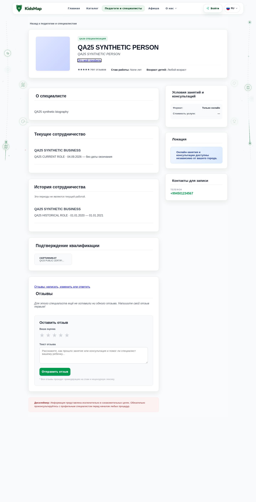

Специалист — большой экран. Онлайн-формат и фактические сведения · ru · 1440px

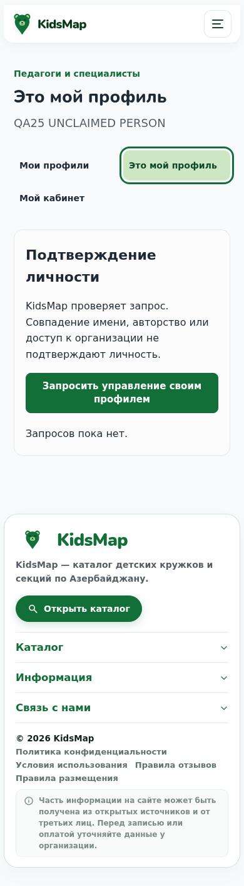

Подтверждение личности. Личный процесс заявления прав · ru · 390px

Документы специалиста. Публичный сертификат и приватные документы в кабинете · ru · 390px

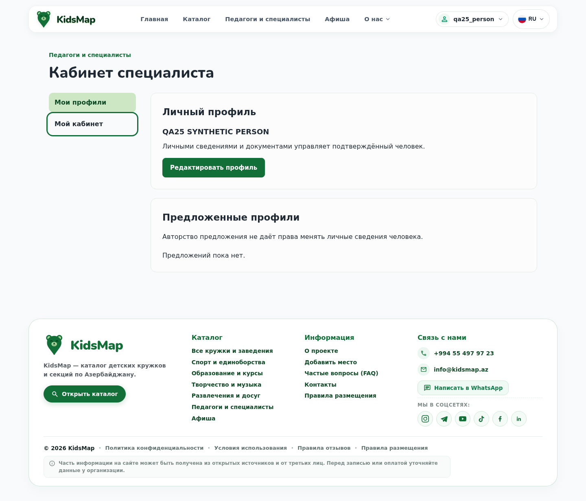

Кабинет специалиста. Личная рабочая область · ru · 1440px

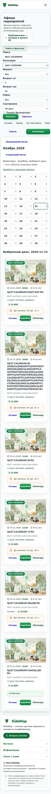

Мобильный календарь. Выбор дня и список событий · ru · 390px

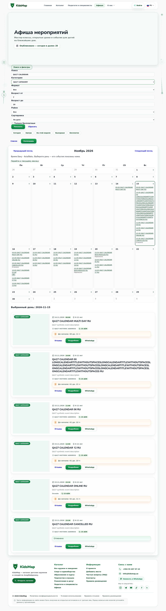

Календарь — большой экран. Полный месяц и отдельный выбранный день · ru · 1440px

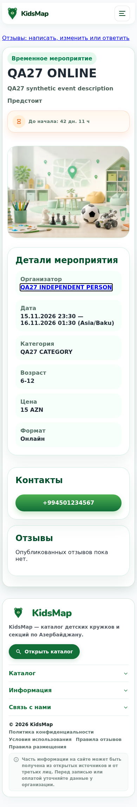

Онлайн-событие. Организатор, даты по Баку, отсутствие выдуманной площадки · ru · 390px

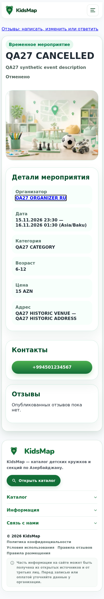

Отменённое событие. Публичная карточка сохраняет честное состояние · ru · 390px

Перенос события. Новое время и история изменений · ru · 1440px

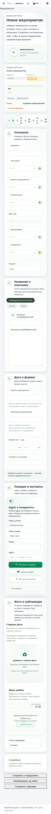

Добавление события администратором. Мобильная форма с языковыми вкладками · ru · 390px

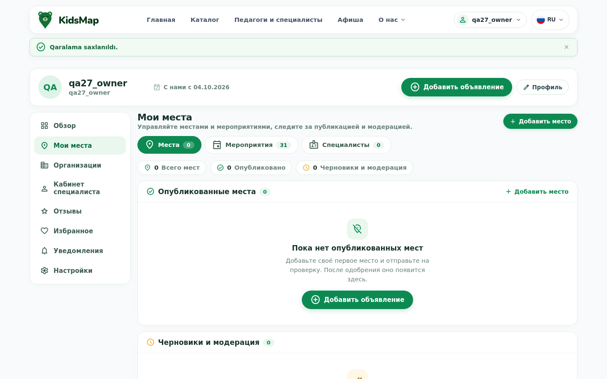

Успешное сохранение владельцем. Реальный POST; точные секунды сохранены в БД · ru · 1440px

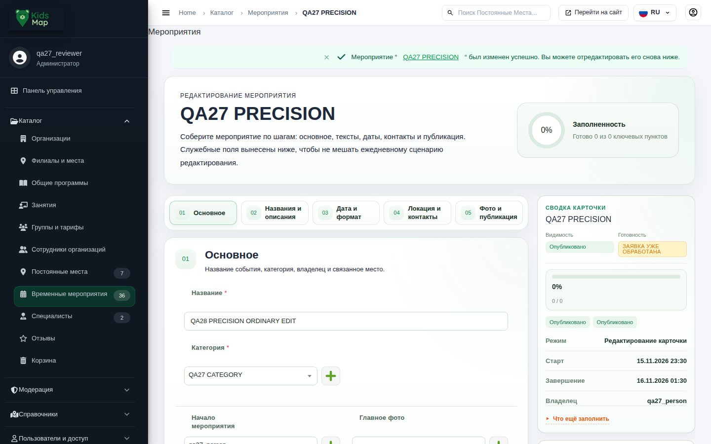

Успешное сохранение администратором. Реальный POST опубликованного события, без потери точности · ru · 1440px

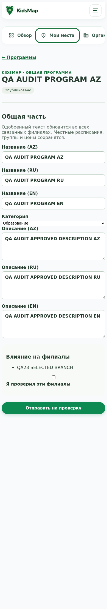

Общая программа. Влияние общей программы на конкретный филиал · ru · 390px

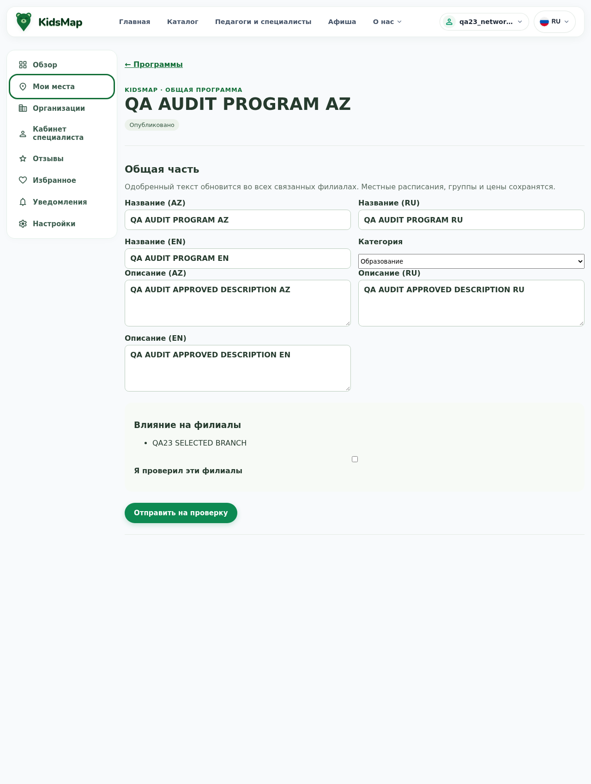

Программа — большой экран. Переводы, категория и подтверждение затронутых филиалов · ru · 1280px

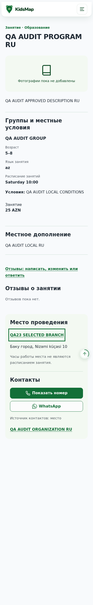

Публичное занятие. Общая программа плюс местное расписание, группа и цена · ru · 390px

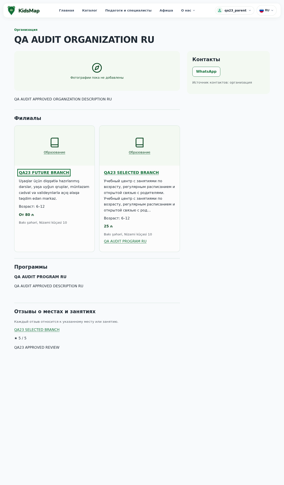

Публичная организация. Филиалы, общие программы и контакты · ru · 1280px

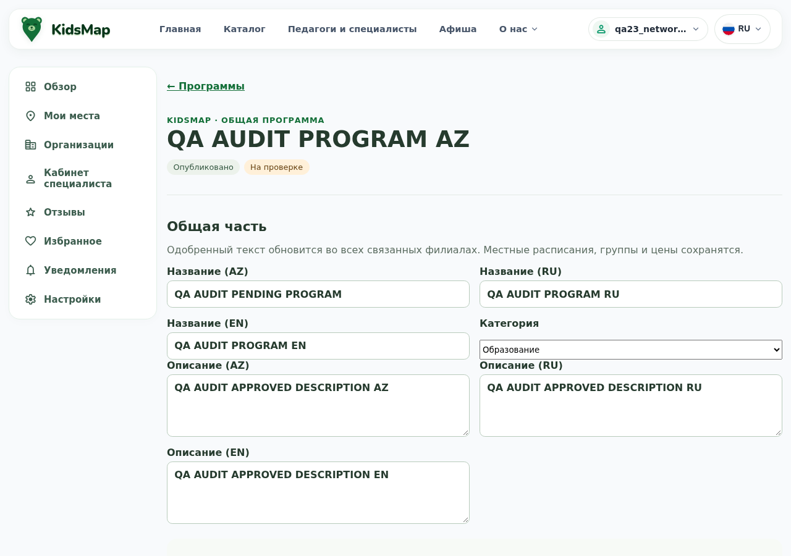

Программа после отправки изменения. Реальный native POST владельца; изменение ожидает проверки, опубликованный текст прежний · ru · 1280px

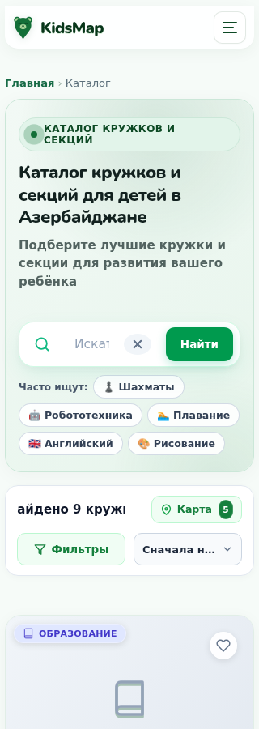

Счётчик результатов на узком экране. Фактический текст и clipping проверены отдельной геометрией DOM · ru · 320px

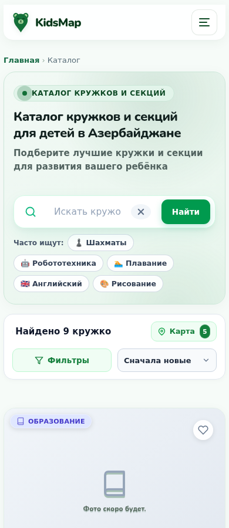

Счётчик результатов на мобильном экране. Сравнение со 320px без изменения приложения · ru · 390px

## 11. Пробелы проверки и границы окончательного вывода

Статус «частично подтверждено» не означает, что весь этап отсутствует. Он означает, что доказательства покрывают конкретные сценарии, а весь составной пункт нельзя честно назвать проверенным. Остаток раскрыт в каждой строке приложения. Процент «готовности продукта» не вычисляется из числа тестов: требования различаются по объёму, а один тест может проверять несколько связей.

- Production revision, реальные данные и конфигурация, полноценная проверка миграции/доступности и recovery в целевой среде — не проверены.
- Реальные OAuth/Maps/SMTP/GA4, внешние CDN и фактическое расписание outbox runner — не заменяются local stubs.
- Физические iOS/Android устройства, Safari/Firefox, полный screen-reader audit, реальные звонки/WhatsApp и production нагрузка — не выполнены.
- 306 строк requirements-map имеют разную силу доказательств: source, existing/fresh tests, accepted prerequisites, partial/external. Ни один общий зелёный module-run не является автоматическим подтверждением каждой фразы.
- Полный image-suite проверяет код в точном runtime с disposable PostgreSQL; это не запуск всего production compose stack, не реальный TLS и не registry publication.
- Ряд старых тестов привязан к прошлой структуре формы, новым optional fields или прежним правилам. Индивидуальная причинная сверка и её пределы описаны reviewers; blanket «все failures безвредны» не заявлено.

### Сводка всех требований: укрупнённые группы

| Сила подтверждения | Количество |
|---|---|
| Есть упавшая проверка части требования | 1 |
| Есть частичные доказательства; границы указаны отдельно | 247 |
| Исторические согласования и границы этапов | 53 |
| Конкретный локальный сценарий подтверждён полностью | 1 |
| Отдельная проверка не выполнена или не установлена | 1 |
| Подтверждён функциональный пробел | 1 |
| Соблюдение процедуры подтверждено | 2 |

## 12. Доказательства, воспроизведение и рекомендации

[Domain review](domain-review.md) · [Security/release review](security-review.md) · [Browser review](browser-review.md) · [Требования 306](REQUIREMENTS.md) · [Дорожная карта запуска](release-gates.json) · [План](PLAN.md) · [Входной snapshot](entry.json) · [Сохранность исходников](final-verification.json) · [Сверка host/image](image-full-comparison.json).

Root full: `wsl -d Ubuntu-24.04 -u root --exec /bin/bash /mnt/c/kidsmap/docs/task33/qa26/backend_run.sh all final-audit-full-20261004`. Image full: `wsl -d Ubuntu-24.04 -u root --exec /root/km28-db/.venv/bin/python /mnt/c/kidsmap/docs/task33/final-audit/qa/image_full_run.py --mode all --output /tmp/task33-final-audit-image-full-20261004`.

Исправленный image QA-повтор: `wsl -d Ubuntu-24.04 -u root --exec /root/km28-db/.venv/bin/python /mnt/c/kidsmap/docs/task33/final-audit/qa/security_image_full_r2.py --mode all --output /tmp/task33-final-audit-image-r2-20261004`. Это тот же образ и те же application assertions; отличаются только допустимые временные каталоги и монтирование принадлежащего тесту сокета.

Имена run/output уникальны: для повторения нужно новое имя, а не перезапись сохранённых результатов. Full/native/browser raw traces находятся вне Git в `/root/task33-evidence/`; safe JSON, ссылки и выбранные synthetic screenshots находятся в этом каталоге.

Все первоначальные неудачные QA-attempts сохранены: browser wrapper post-run failure, diagnostic adapter errors, original JS assertion failure. Основные 798 browser contexts получены в чистых запусках. Дополнительный Program-набор содержит ошибку ViewTransition при прошедших бизнес-проверках; она учитывается в строгом итоговом статусе. Результаты не собраны путём удаления failed assertions.

**Рекомендация владельцу:** принять результат аудита как подтверждение работающей основной системы и конкретного оставшегося объёма. Сначала закрыть поиск и регрессионные gates, затем подтвердить эксплуатационную готовность. Говорить «вся задумка окончательно реализована и готова к боевому запуску» сейчас преждевременно.

[Все306 требований](REQUIREMENTS.md) · [Интерактивный HTML-отчёт](report.html)
