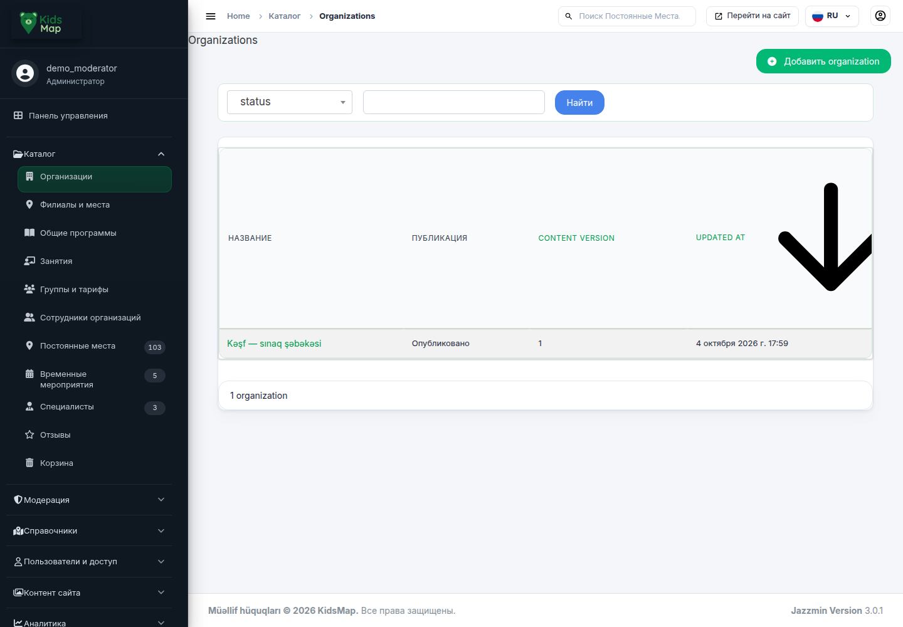
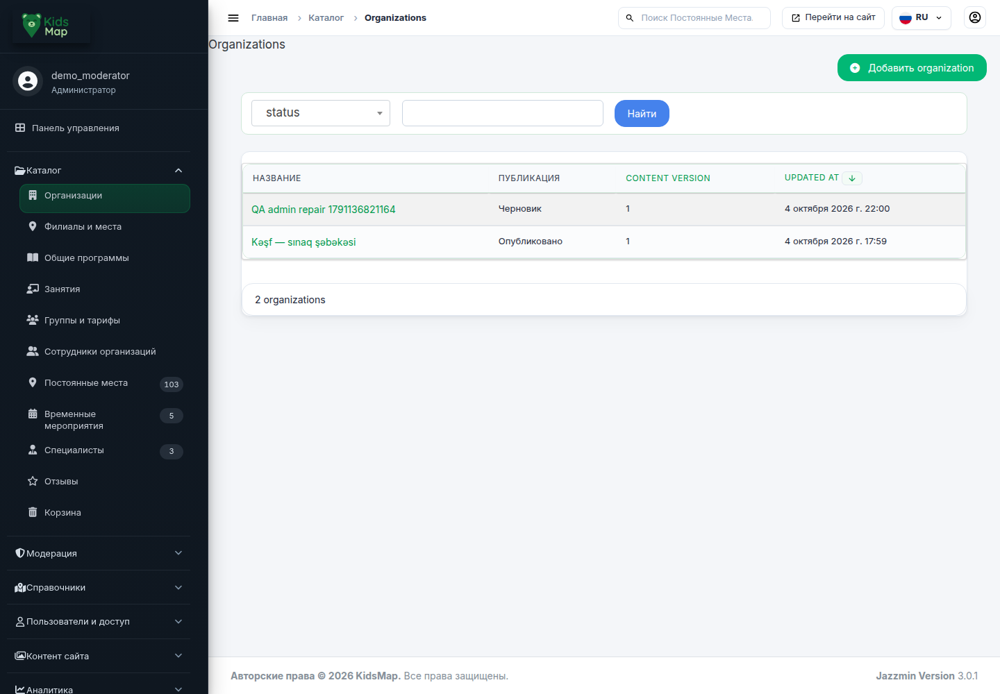
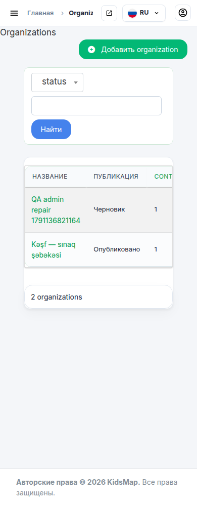
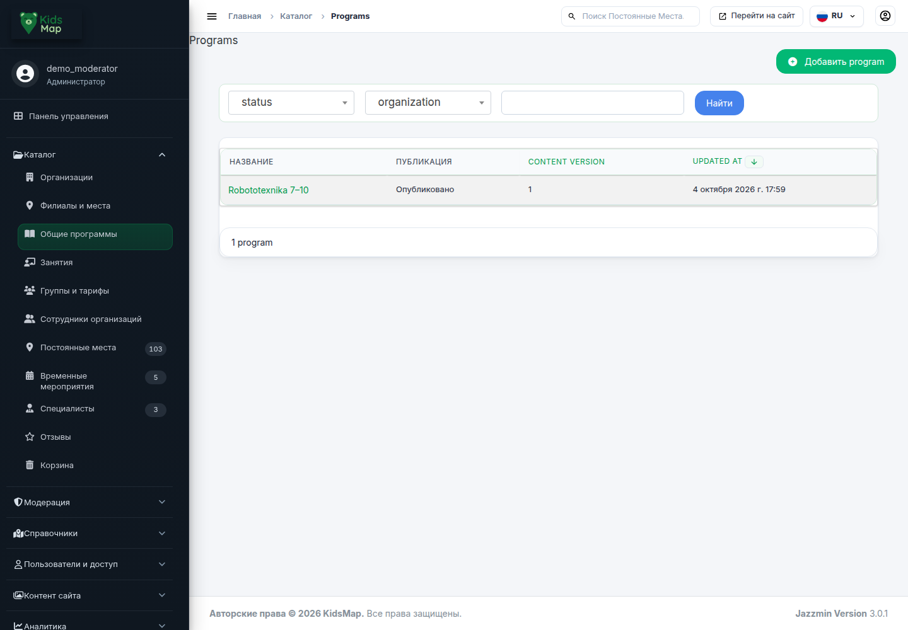
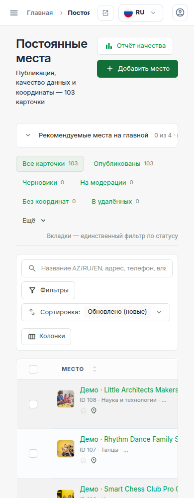
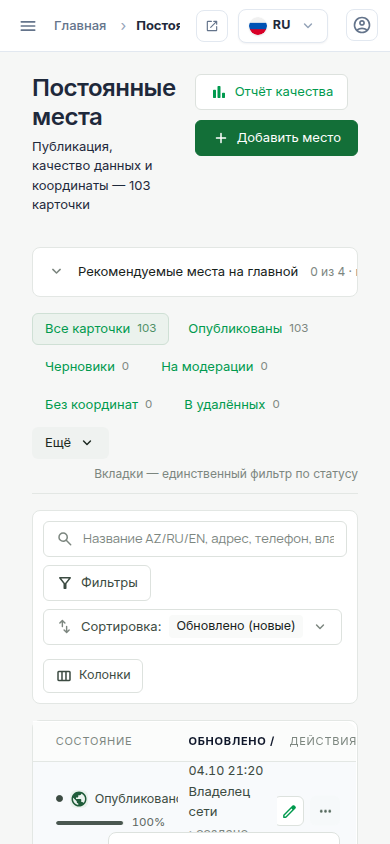
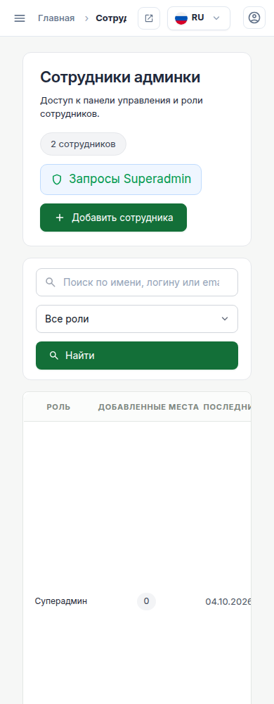
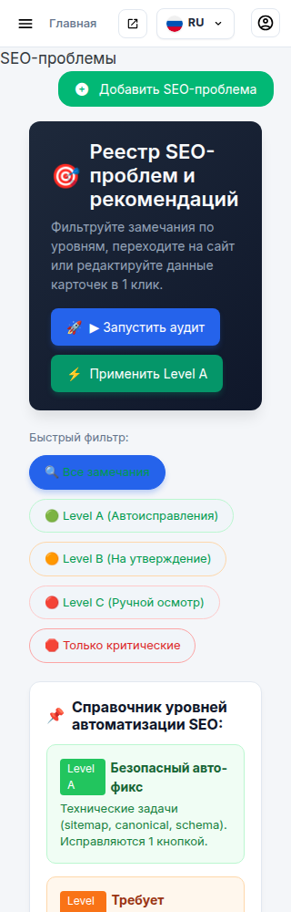

# Исправление админки KidsMap — 4 октября 2026

## Что сломалось и что исправлено

Проблема на присланном скриншоте воспроизведена в реальном Chromium на локальном стенде. Общий шаблон таблицы выводил SVG стрелки сортировки, но размеры этого компонента задавались только в CSS специального списка мест. Организации, программы, занятия и группы этот CSS не загружали. Стрелка организации занимала 266 px, заголовок таблицы — 287 px.

Размеры и состояние стрелки перенесены в общий стиль таблиц: 14 × 14 px, поворот для обратной сортировки, `aria-sort` у активного заголовка. Размеры также указаны в HTML. Обновлены версии CSS для кеша браузера. Бизнес-операции и данные этой правкой не меняются.

Расширенная проверка нашла дополнительные подтверждённые дефекты:

| Дефект | Причина | Исправление | Проверка |
|---|---|---|---|
| Огромные стрелки в четырёх общих списках | Компонент зависел от CSS отдельной страницы | Общий CSS, безопасные размеры SVG, доступное состояние сортировки | Те же шесть списков × 390/1440: 12/12 PASS; стрелки 14 px, заголовок 41 px |
| Страница списка мест шире мобильного экрана | `overflow:visible!important` у обёртки широкой таблицы | Горизонтальная прокрутка внутри поверхности таблицы | Страница не расширяется; меню действий остаётся доступным |
| Строки мест по 431 px на узком экране | При фиксированной раскладке колонки даты/статуса сжимались до нулевой ширины | Минимальная ширина таблицы внутри её прокрутки | Проверка высоты первой строки ≤120 px на 320/360/390 ×3 языка |
| Кнопки списка мест и сотрудников выходили за край | Flex-строки не переносились | Перенос кнопок в собственных заголовках | Доступная кнопка добавления, ширина страницы равна экрану |
| Меню «Ещё» уходило влево после переноса кнопки | Правый край меню привязан к маленькой кнопке | Мобильное меню привязано к панели вкладок; закрытое содержимое скрывается | Открытие/закрытие и границы меню на трёх мобильных ширинах |
| SEO-фильтр расширял страницу | Select2 задавал фиксированную inline-ширину | Размер контейнера ограничен доступной шириной | Открытие списка, границы popup, закрытие Escape |
| SEO-справочник расширял экран 320 px | Минимум grid-колонки 260 px плюс внутренние отступы | Минимум колонки ограничен 100% контейнера, контейнер допускает сжатие | 320/360/390 × AZ/RU/EN |
| Некорректный `class` у заголовка действий Place | В `class` вставлялся уже готовый атрибут `class="…"` | Используется готовый атрибут без второго обрамления | Столбец действий имеет правильный класс |
| RU «Сохранить»/copyright отображались на AZ, Home на EN | Отсутствующие RU записи попадали в fallback основного языка | Явные RU переводы и компиляция каталога локального runtime | Нативное переключение RU/AZ/EN, три формы: PASS |

## Реальные действия

| Сценарий | Результат |
|---|---|
| Сортировка с клавиатуры Enter и обратная сортировка мышью | PASS; `aria-sort` и направление стрелки меняются |
| Поиск мест «Baku» | PASS; четыре результата на текущих фикстурах |
| Фильтр опубликованных организаций | PASS; одна исходная опубликованная организация |
| Поиск без совпадений | PASS; пустой список |
| Отправка Organization с неверным URL | PASS; серверная ошибка видна в форме |
| Исправление URL и сохранение нового черновика | PASS; новая организация сохранена и повторно открыта |
| Меню действий Place, меню статусов и SEO-фильтр на телефоне | PASS; видимы и находятся внутри экрана |

Создан **один синтетический QA-черновик организации** с именем `QA admin repair …`. Исходная опубликованная организация не редактировалась. 100 добавленных ранее демо-мест сохранены; каталог содержит 103 опубликованных места. Полный хеш всех полей трёх исходных мест совпадает с состоянием до наполнения.

## Объём проверок

- Backend: **270 тестов, 0 failures, 0 errors, 0 skipped**, PostgreSQL, `DJANGO_TESTING=1`. `check`, `makemigrations --check` и safety guards PASS; одноразовая тестовая БД корректно удалена.
- Backend снимок записан в `backend-source-snapshot.json`. После этого прогона изменён только CSS мобильной таблицы и меню в `kidsmap_changelist.css`; финальный CSS проверяется реальным браузером. Backend-тесты для этой последней CSS-правки повторно не запускались.
- Общая матрица: **35 ссылок бокового меню и 14 форм** добавления/редактирования (Organization, Program, Activity, OfferingGroup, Place, Event, Specialist), AZ/RU/EN ×390/1440; четыре общих списка и четыре редактора дополнительно ×768/1024/1280: **366/366 PASS**. Финальный повторный проход записан в `browser-matrix.json` и полном raw log.
- Отдельно **27/27 PASS** Place/Staff/SEO × AZ/RU/EN ×320/360/390: ширина страницы, высота строк, открытые меню, доступность кнопок, Escape; `browser-mobile.json`.
- Ошибки `pageerror`, console error, неуспешные запросы и HTTP≥400 собираются и влияют на результат. Ошибки браузера не подавляются.
- Ранее выполненный полный набор 1844 host/image здесь **не повторялся**. Его доказательства в `completion/` сохраняются как исторический результат. Этот запуск проверяет исправление админки, а не все функции и интеграции сайта.
- Некоторые названия моделей и полей общих бизнес-редакторов остаются английскими. Полная редактура терминологии всех экранов этим запуском не заявляется.

## Скриншоты

До исправления:

После исправления:

## Как проверить самому

1. Откройте [список организаций](http://localhost:8780/admin/catalog/organization/). Вход: `demo_moderator` / `KidsMap-local-2026` — исключительно локальная демо-учётная запись.
2. Нажмите `Ctrl+F5`. Заголовок таблицы должен быть обычной высоты; стрелка сортировки маленькая. Клик по дате переключает сортировку.
3. Проверьте «Общие программы», «Занятия», «Группы и тарифы»: таблицы должны сохранять нормальную высоту. Табуляцией выберите сортируемый заголовок и нажмите Enter.
4. Включите мобильную ширину 320 или 390 px. В «Постоянных местах» горизонтально прокручивается таблица, сама страница не выходит за экран. Строки остаются компактными; меню «…» и вкладка «Ещё» открываются в пределах экрана.
5. В «Пользователи и доступ → Сотрудники» кнопка добавления доступна. В SEO-реестре фильтр открывается и закрывается Escape, карточки справочника помещаются на экран.
6. Переключите RU/AZ/EN через верхнее меню. В русской форме кнопка сохранения теперь «Сохранить».
7. [Каталог](http://localhost:8780/ru/catalog/) содержит 103 места. [Ручной маршрут остальных функций](http://localhost:8780/qa/) оставлен работающим.

## Сохранение и границы

LOCAL HEAD: `015d031d8eb17114bd860159dde805b38df3c13c`, dirty WORKTREE. Исходные версии изменённых файлов сохранены в `before/`, хеши — `preserved-files.json`. Новый runtime `/root/km-manual-adminfix`; прежние `/root/km-manual-mapfix` и `/root/km-completion-browser` не изменяются. Манифест фиксирует 2761 исходный файл WORKTREE/runtime и 12 изменённых файлов приложения.

Новая отчётность находится в этой папке. Исторические `completion/` и `final-audit/` проверяются по их SHA-манифестам и не переписываются. Никаких production, миграций рабочей БД, commit/push/deploy. Приложение оставлено локально на 8780, PostgreSQL без сети и опубликованных портов. Итоговые проверки сохранения и HTTP — `final-verification.json`.

Финальная сверка PASS: **15 сохранённых оригиналов**, **2761/2761 SHA WORKTREE/runtime**, старые runtime **2761/2760** без изменений, **146/146** файлов completion и **164/164** файлов final-audit без изменений (включая дополнительные три файла вне внутреннего списка161). Все12 HTTP-проверок PASS; дополнительно Windows `localhost:8780/admin/login/` отвечает200. `git diff --check` exit0. `active_run: NONE`; журнал обновлён. Две собственные headless-browser сессии закрыты, локальный HTTP/БД оставлены работающими.

Для повторения: `prepare_preview.py`, существующий `../qa/start.py`, `regression.js`, `browser-matrix.js`, `browser-mobile.js`, `browser-locale.js`, `verify_data.py`, `collect.py`. Команды browser CLI выполняются из `/root/task33-browser-tools` с `PATH=/root/task33-browser-tools/node_modules/.bin:/usr/local/bin:/usr/bin:/bin`. Backend использовал `docs/task33/qa04/run.py` с семью labels из `backend/run.json`; точные аргументы сохранены там.

QA-поправки: первая проверка AZ ожидала другой синоним «Главная» и была приведена к принятому `Ana səhifə`; первая отправка URL не открыла вкладку контактов, а проверка перенаправления не учитывала hash активной вкладки. Эти ошибки сценария исправлены без ослабления проверки приложения. Два запроса сразу после старта попали до готовности HTTP; повтор сделан после явного ответа HTTP200. Один промежуточный JSON общей матрицы был усечён лимитом вывода; окончательный запуск пишет полный raw log в файл. Переполнения и меню подтверждены отдельными сохранёнными диагностическими данными.
