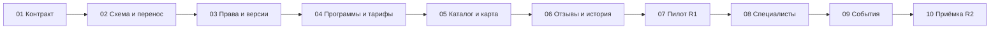

# KidsMap №33 — задачи, модели и готовые промпты

Подготовлено 23 сентября, проверено 24 сентября 2026 года · План выполнения, реализация ещё не начата

## 1. Сколько задач и как их вести

Рекомендация: **одно общее ТЗ и 10 последовательных задач Codex**, каждая со своим результатом, проверкой и передачей контекста. Это стартовая разбивка: после сверки текущего кода задача может потребовать нескольких итераций или разделения. Десять промптов не означают гарантированные десять сообщений до готовности сайта.

Этот разговор можно оставить для продуктовых решений. Реализация должна происходить в актуальном репозитории KidsMap, а не в папке этого аудита и не в исследованном старом клоне. Общее ТЗ и журнал решений следует сделать доступными из выбранного проекта. Здесь новые задачи приложения не созданы и код не изменён.

Обычно одновременно работает один исполнитель и независимый проверяющий. После фиксации схемы и прав можно отдельно поручить часть интерфейса, переводов или проверки. Изменения общей модели и миграций интегрирует один ответственный; разные исполнители не должны одновременно менять один контракт без согласования.

Для передачи между задачами использовать документ в репозитории, например `docs/task33/implementation-status.md`: текущий commit, завершённый этап, принятые архитектурные решения, проверки, остаточные ограничения и следующий этап. Полная история чата не заменяет этот файл.

## 2. Модель и режим

**Если выбирать одну модель на весь проект — GPT-6 Astra.** Она соответствует требуемой глубине архитектуры, миграции и проверки прав. OpenAI описывает её как модель для сложных сквозных задач, включая программирование. Это официальное назначение модели; распределение этапов ниже — моя рекомендация для KidsMap. [GPT-6 Astra](https://developers.openai.com/api/docs/models/gpt-6-astra).

| Работа | Рекомендация |
| --- | --- |
| Сверка архитектуры, перенос данных, права, сложные отзывы | GPT-6 Astra, `xhigh`, если этот уровень доступен |
| Формы, страницы, специалисты и события по утверждённому контракту | GPT-6 Astra, `high` |
| Независимая итоговая проверка и разбор спорной миграции | GPT-6 Astra, `xhigh` |
| Обычные ограниченные правки интерфейса после утверждения модели | Допустим GPT-6 Sol, `high`, если есть в выборе моделей |

Для Sol официальная документация отдельно рекомендует современные универсальные модели для работы Codex с кодом. Доступность в конкретном меню зависит от среды/аккаунта; название модели в API не доказывает её наличие в вашем приложении. [Рекомендации по программированию](https://developers.openai.com/api/docs/guides/code-generation), [выбор моделей в Work и Codex](https://learn.chatgpt.com/docs/models).

Более высокий уровень рассуждений может занимать больше времени и токенов; `max`/`ultra` не являются обязательным условием качества. Для этой задачи начнём с указанных уровней, повышая их для конкретной нерешённой сложности. Новые модели, режимы и тарифы не переключались автоматически. Стоимость API не приравниваем к расходу лимита подписки; точное время и число итераций без актуального кода и тестовой базы не обещаем.

## 3. Последовательность и контрольные результаты

| № | Задача | После | Проверяемый результат | Модель |
| --- | --- | --- | --- | --- |
| 01 | Актуальный код и архитектурный контракт | — | Сверенный паспорт проекта, схема, открытые решения и карта переноса | Astra xhigh |
| 02 | Совместимая схема и инструмент пробного переноса | 01 | Новые структуры, повторяемый dry-run, прежний сайт работает | Astra xhigh |
| 03 | Владение, менеджеры и версии публикаций | 02 | Проверяемые права и редактирование без исчезновения публичной версии | Astra xhigh |
| 04 | Программы, группы, тарифы и кабинеты | 03 | Создание/редактирование реальных предложений без дублирования общих текстов | Astra high |
| 05 | Каталог, карточки, карта и локализация | 04 | Корректный подбор и отображение на телефоне/широком экране | Astra high |
| 06 | Отзывы R1 и история филиалов | 05, решения 25/30 для зависимого поведения | Изолированные рейтинги, модерация, закрытие и согласованный переезд | Astra xhigh |
| 07 | Репетиция переноса и пилот R1 | 06 | Сверка данных/прав/URL, проверенный откат, пакет запуска пилота | Astra xhigh |
| 08 | Профили и связи специалистов | 07 | Заявление владения, взаимные подтверждения и сохранение истории | Astra high |
| 09 | События и афиша | 08, решение 28 для вида афиши | Организатор отдельно от площадки, онлайн, даты, история и отзывы Event | Astra high |
| 10 | Независимая приёмка R2 и выпуск | 09 | Исправленные существенные дефекты, репетиция выпуска и итоговые доказательства | Astra xhigh |

R1 готов к пилоту после задачи 07. Его расширение проводится по результатам пилота; новый специалист или Event не должен быть условием существования обычного филиала. В задачах 08–10 обновлённые разделы также проходят тестовый запуск перед расширением.



Это порядок интеграции. Независимый просмотр схемы, макетов, локализации и тестов может идти параллельно с исполнением. Ни один этап не объявляется завершённым только потому, что файлы созданы: нужны проверки его поведения.

## 4. Общий контекст для каждой задачи

Перед каждым промптом передайте этот блок и соответствующее задание. Приложите [ТЗ](KidsMap_Task_33_Spec_2026-09-23.md) и [журнал решений](KidsMap_questions_and_decisions.md), либо укажите их проверенные пути в рабочем проекте. Не заменяйте путь к проекту адресом старого аудиторского клона.

```text
Работаем над KidsMap №33 в актуальном репозитории проекта. Основные источники — KidsMap_Task_33_Spec_2026-09-23.md, KidsMap_questions_and_decisions.md и результат предыдущего этапа. Сначала прочитай местные правила проекта и статус реализации, затем проверь относящийся к задаче код. Более поздние явные решения владельца имеют приоритет над рекомендациями старого аудита.

Сохрани существующий Django-проект, данные, старые ссылки и текущие незакоммиченные изменения. Изменения выполняй в согласованном рабочем checkout или изолированной ветке, тесты — с предусмотренным проектом тестовым режимом и изолированными DB/cache/media. Миграции, ограничения и конкурентные правки проверяй на том же движке БД, что у рабочего проекта (в исследованном срезе PostgreSQL, подтвердить в 01). Документ аудита не подтверждает текущую версию production.

Выполни только этап ниже, включая необходимые исправления и проверки. Выбирай обычные технические детали самостоятельно в рамках ТЗ. Решения 25 и 30 предварительные, 28 открыт: связанные с ними необратимые преобразования и включение нового поведения требуют зафиксированного продуктового выбора. Продолжай независимую часть работы, если конкретная развилка ещё открыта.

Рабочий результат должен быть доступен для проверки: изменения, миграции где нужны, значимые тесты, короткий отчёт и обновлённый docs/task33/implementation-status.md. В отчёте укажи commit/версию, что проверено, что не проверено, остающиеся риски и следующий шаг. Не выдавай наличие шаблона или локальное прохождение теста за готовность production. Запуск на боевом сайте не является частью этих стартовых промптов: подготовь конкретный проверенный пакет для отдельного запуска.
```

Структура промптов следует принципу «результат, нужный контекст и существенные границы», а не перечню всех возможных команд. [Официальная памятка по промптам](https://learn.chatgpt.com/docs/prompting).

## 5. Готовые задания

### 01. Сверить проект и зафиксировать контракт

```text
Выполни подготовительный этап KidsMap №33. Сверь актуальный репозиторий, ветку, незакоммиченные изменения, версии зависимостей, существующие модели, миграции, публичные маршруты, правила публикации и доступа с ТЗ. Исследованный в аудите commit 45cf6b92b49dc068cb391558ac0013e51eaf514c используй только как историческую опору.

Подготовь архитектурное решение Program → Activity филиала → минимальная группа → существующий PricingPlan; Organization/Place/физическая площадка; owner/manager scope; одобренные и ожидающие редакции; типизированные отзывы; будущие связи Event/Specialist и точки расширения для подписок на сущности без реализации рассылок. Покажи, какие поля уже есть, какие добавляются и кто является источником каждого значения. Отдельно учти тарифы места в целом и неподтверждённые организации.

Для открытых 25, 28 и 30 представь последствия вариантов на конкретных данных, сохрани статус выбора. Остальные обычные решения предложи сам, без нового длинного опроса. Уточни матрицу модерации, конфликты зависимых изменений и целевые ограничения БД. Составь карту legacy → target и порядок десяти этапов с поправкой на фактический код.

Результат: docs/task33/architecture.md, migration-map.md, implementation-status.md и короткий список существенных расхождений с ТЗ. Этот этап — исследование и документы, без изменения схемы/данных приложения. Для следующего этапа укажи воспроизводимые проверки и необходимые входные данные.
```

### 02. Добавить совместимую схему и пробный перенос

```text
Реализуй утверждённую в этапе 01 совместимую основу каталога: Organization, общая Program, Activity филиала, минимальная группа, связи существующего PricingPlan и площадки/истории адресов в объёме принятого контракта. Сохрани старые ID, поля и рабочие пути. Будущие Event/Specialist должны иметь согласованные точки связи, без преждевременного включения их нового интерфейса.

Добавь проверяемые FK, индексы и допустимые ограничения; строгую обязательность новых связей включай только после сверки заполнения. Создай повторяемый инструмент планирования переноса с dry-run и таблицей соответствий: исходный объект, целевой объект, версия правила, основание, контрольная версия источника. Непонятные дубли, сеть и тарифы направляются в ручную очередь KidsMap, не угадываются по имени или тексту.

Проверь пустую и заполненную тестовую БД, повторный запуск, прерывание/продолжение, изменение источника после dry-run и сохранение прежних страниц. Для открытых решений сохраняй данные обоих вариантов; не выполняй разрушительный пересчёт отзывов или объединение переездов. Результат — рабочие совместимые миграции и доказательство повторяемости, без переключения production.
```

### 03. Владение, менеджеры и публикации

```text
Реализуй серверную модель владения и доступа организации. Только владелец выдаёт менеджерам наборы действий с отдельными переключателями и область: выбранные филиалы либо явно «Вся сеть, включая будущие филиалы». Новый филиал не расширяет selected scope и не добавляет полномочий. Общая программа/профиль организации имеют отдельные действия. Старый Place-доступ при переносе не превращается в сетевой.

Раздели предложение организации/филиала, авторство, подтверждённое владение и платформенную модерацию. Сохрани прекращение временного creator-доступа после назначения владельца. Проверь выход филиала из сети и передачу владения по утверждённому контракту.

Реализуй одобренную публичную версию и отдельную проверяемую редакцию. Цена/расписание публикуются по своим правилам, описание — после проверки. Одобрение устаревшего текста не перезаписывает новые значения. Согласованные зависимые пакеты цены/условий обрабатываются целостно. Старые волонтёрские предложения проверяют версию структуры и базовое состояние.

Покрой интеграционными тестами чужие вложенные ID, соседний филиал, новый 11-й филиал, запрет manager delegation, отзыв доступа, pending/rejected и параллельные изменения. Результат — единые сервисы прав/публикации и их использование из относящихся к этапу форм.
```

### 04. Программы, группы, тарифы и редакторы

```text
Реализуй кабинет организации для общих программ и предложений филиалов с учётом этапа 03. Общий одобренный текст Program редактируется централизованно; цены, возрастные группы, расписание и преподаватели остаются местными. Для единственного варианта не усложняй форму лишними обязательными шагами.

Используй существующий PricingPlan. Пробное, разовое посещение и абонемент одной группы показываются внутри одного блока. Сохрани валюту, период, пакеты и доплаты, обработай ограничения возраста и тарифы места в целом. Один серверный источник цены используется в редактировании и публичном отображении. Не создавай группу на каждый тариф автоматически.

Расписание группы — текст, часы работы филиала отдельно. Введи согласованную дату подтверждения условий; неизвестные даты и цены не заполняй догадками. Правка фотографии не подтверждает условия. Новая карточка требует одобренного AZ, RU/EN позже; политика обязательного языка конфигурируема для будущего развития, но основной язык сейчас не меняется.

Проверь сценарии 90 AZN/месяц + обязательный взнос + бесплатное пробное, конфликтов возраста, изменения Program без потери местных условий и работы сотрудника с ограниченными правами. Результат — готовые формы и серверные операции, без системы учеников, набора, оплаты и бронирования.
```

### 05. Каталог, карта, карточки и языки

```text
Переведи публичные страницы каталога на новые предложения через совместимый путь. Один филиал — одна карточка результата; внутри только направления и варианты, удовлетворяющие всем выбранным условиям одновременно. Категории/подкатегории доступны, бюджетный фильтр исключён. Не соединяй возраст английского с категорией рисования того же центра. Это правило действует и для legacy: неподтверждённое сочетание не даёт точного совпадения, карточка сохраняет прямую страницу и подходящий общий каталог. Исключи двойную выдачу одного филиала через старый и новый пути.

Покажи общую площадку одной точкой с отдельными независимыми филиалами; список внутри точки также учитывает фильтры. Карточки без координат остаются в каталоге с понятным состоянием. Близость координат не объединяет бизнесы. Реализуй страницы Organization/Place/Activity, условия и прямые контакты, согласованный вид истории закрытых филиалов.

Сохрани текущие AZ/RU/EN-пути и проверь карту старых URL. Реализуй согласованную политику отсутствующего перевода, canonical/hreflang и sitemap; не объявляй AZ-текст переводом RU/EN. Язык интерфейса не меняет валюту, страну или язык занятия.

Проверь мобильный и широкий экран, длинные названия/переводы, изменение ширины без потери меток фильтра, цену на карточке и детали. Сними сравнимые измерения выдачи и запросов БД. Результат — проверяемый интерфейс с примерами и браузерными доказательствами, без общего нового фреймворка.
```

### 06. Отзывы R1 и история филиалов

```text
Реализуй отзывы филиала и конкретного Activity по окончательно зафиксированному решению 25. Сохрани исходные отзывы, реакции, авторов и модерацию. Общий сервис должен поддерживать будущие Event/Specialist, но отзыв всегда имеет одну проверяемую цель. На Organization показывается связанная лента без общего балла.

Все новые отзывы проходят KidsMap. Бизнес может ответить или пожаловаться, но не редактировать, скрывать и одобрять чужие записи. Новая редакция отзыва не заменяет старую публичную до одобрения. Pending/rejected не вытесняют учтённую оценку. Различай количество текстов и вкладов; unknown user не превращает все записи в одного автора. Если решение 25 ещё открыто, подготовь сравнение расчётов и совместимые сервисы без массового переключения формулы.

Реализуй закрытие по 31A и выбранный вариант переезда 30. При 30A сохрани адресные периоды, отметки старых отзывов, актуализацию фото/удобств и честную подпись общего балла; при 30B используй согласованную связь двух карточек. Не угадывай место посещения по дате публикации. Открытый 30 не разрешает автоматическое объединение.

Проверь отсутствие смешанных рейтингов, версии, повторные отзывы, пересчёт обеих целей после разрешённого переноса, старые ссылки и закрытые страницы. Результат — согласованное поведение R1 и отчёт сравнения исходных/новых данных.
```

### 07. Репетиция переноса и пилот основы

```text
Подготовь пилот R1 на изолированной репрезентативной копии. Подбери тестовые случаи одиночного центра, сети, независимых организаций по одному адресу, разных групп/тарифов, отсутствия координат и истории. Реальные участники пилота должны быть явно определены командой KidsMap, не придуманы исполнителем.

Выполни dry-run, разбор ручной очереди, пробное применение и сверку ID, отзывов/реакций, тарифов, медиа, прав, ожидающих редакций и URL. Подтверди повторяемость и защиту свежих правок. Записи без ответа владельца сохраняют совместимость и не останавливают весь каталог.

Проверь резервное восстановление и сценарий отката после появления новых данных. Покажи отдельно, как отключается новый интерфейс, сохраняются новые записи и выбирается исправление вперёд либо обратное преобразование. Не выдавай восстановление старой копии с потерей свежих записей за успешный откат.

Пройди приёмку R1 из ТЗ, включая смешанную выдачу перенесённых и неоднозначных legacy-карточек без ложных совпадений и дублей. Подготовь переключатели охвата, наблюдение и порядок расширения. Результат — протокол пилота в тестовой среде, устранённые блокирующие дефекты и конкретный пакет для запуска. Боевой запуск выполняется отдельным явно порученным действием.
```

### 08. Специалисты и подтверждение связей

```text
Обнови Specialist на новой основе. Один профиль человека может иметь несколько специализаций и рабочих мест. Сам специалист или организация предлагают профиль; авторство не даёт владение личностью. Реализуй проверяемое заявление владения и передачу управления в аккаунт подтверждённого человека, без передачи чужого аккаунта.

Рабочая связь требует подтверждения организации и специалиста. Старое place_id и одностороннее приглашение не являются доказательством обеих сторон. Управление филиалом не даёт прав на биографию, контакты и приватные документы. Завершение связи сохраняет прошлые участия; событие не доказывает постоянную работу.

Сохрани частные кабинеты и онлайн-практику. Исправь путь, который удаляет PracticeLocation при переходе в онлайн, если он затрагивает сохраняемую историю. Подтверждённые дубли объединяются с происхождением, реакциями и ссылками; совпадения имени недостаточно.

Подключи согласованную модель отзывов и редакций без скрытой смены их политики. Проверь чужие документы, конфликт claims, повторное приглашение, отзыв связи, доступ менеджера и сохранение прошлых событий. Результат — готовый раздел и перенос на тестовой копии; система личных помощников не добавляется.
```

### 09. События и простая афиша

```text
Реализуй Event с одним основным организатором Organization либо подтверждённым самостоятельным Specialist. Площадка независима от организатора, формат — одно физическое место или онлайн. Владелец площадки не получает доступ к чужому событию. Онлайн не требует выдуманного Place/координат.

Раздели публикацию и состояние проведения. Даты и часовой пояс конкретны; завершение, отмена и перенос не уничтожают историю. Сохрани фактическую площадку прошедшего события при переезде филиала, участников и отзывы. Не заменяй старое проведение будущим под той же идентичностью. Цена и внешняя связь с организатором показываются без встроенной регистрации/оплаты.

Реализуй вид афиши только после фиксации решения 28. Рабочая рекомендация — ближайшие по дате, компактные период/возраст/категория/формат; календарь, автоматические серии и сортировка по чужому рейтингу не заказаны. Регулярный текст направления не генерирует события. Для списка предусмотри выбранный период, страницы и согласованную защиту дублей/массовой отправки без выдуманной платной квоты.

Проверь публикацию/отмену/завершение, часовой пояс, внешнюю площадку, независимого специалиста, права, отдельный EventReview и соответствие JSON-LD странице. Результат — готовый раздел и миграция в тестовой среде с сохранением истории.
```

### 10. Независимая приёмка и подготовка полного выпуска

```text
Проведи независимую проверку итогового diff и поведения KidsMap №33, исходя из ТЗ и зафиксированных решений. Сначала проверь наиболее рискованные связи: миграции, старые права, публикации/конкурентные правки, отзывы и их цели, Specialist private data, Event history, адресные периоды, старые URL и переводные страницы.

Проверь сквозные сценарии родителя, владельца сети, менеджера selected/all_network, волонтёра, специалиста и модератора. Повтори необходимые тесты на итоговом состоянии, проверь браузером AZ/RU/EN и мобильный экран. Исправь обнаруженные дефекты в рамках текущего этапа; покажи оставшиеся ограничения отдельно от пройденных проверок. Не восполняй отсутствие реальной проверки обещанием.

Проведи репетицию выпуска R2 и восстановления, включая записи, созданные после переключения. Подготовь конкретные версии, миграции, переключатели, проверку после запуска и условия остановки расширения пилота. Сверь контракт архивов/canonical/hreflang, отсутствие ложных цен и наследованных рейтингов.

Результат — проверенный пакет полного выпуска, журнал исправлений и статус критериев приёмки. Производственный запуск остаётся отдельным явным действием. В финальном отчёте укажи, какие пункты ещё требуют внешних данных или решения, без объявления их выполненными.
```

## 6. Как оценивать завершение и объём

Для каждой задачи нужны три вещи: проверяемое поведение, доказательства сохранности затронутых данных/прав и понятный следующий шаг. Отчёт вида «созданы модели, тесты зелёные» недостаточен, если не проверены миграция и пользовательский сценарий данного этапа.

После 01 уточняется трудоёмкость по текущему коду. После 02/07 — по сложности реальных данных. Без этих сведений точные часы, бюджет токенов и число запусков будут выдумкой. Для контроля затрат лучше ограничивать задачу результатом, а не пытаться провести весь проект одним очень длинным запросом.

Практический старт — **задача 01 на GPT-6 Astra** с приложенным ТЗ. Затем двигаться по таблице, сохраняя архитектурные решения и проверенные результаты между задачами. Одобрение общего направления не превращает предварительные 25/28/30 в окончательные решения.

## 7. Проверенные источники о моделях

Проверено 23.09.2026. Рекомендации по конкретным десяти задачам — инженерная оценка для KidsMap, не правило OpenAI.

- [GPT-6 Astra](https://developers.openai.com/api/docs/models/gpt-6-astra) — назначение для сложных задач и поддерживаемые уровни API.
- [Модели семейства GPT-6](https://developers.openai.com/api/docs/guides/latest-model) — роли Astra/Sol/Luna.
- [Codex и генерация кода](https://developers.openai.com/api/docs/guides/code-generation) — рекомендации по современным моделям.
- [Модели в приложении](https://learn.chatgpt.com/docs/models) — выбор и уровень рассуждений в текущей среде.
- [Промпты](https://learn.chatgpt.com/docs/prompting) — постановка результата, контекста и границ.
