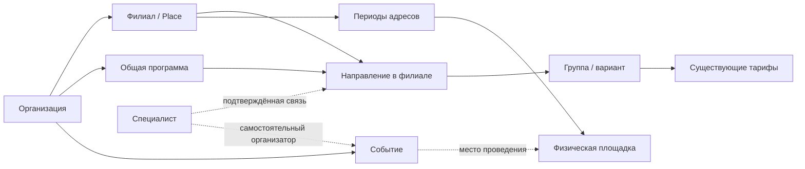

# KidsMap №33 — архитектура каталога и стратегия внедрения

Версия 1.0 для совместного рассмотрения · подготовлено 23 сентября, проверено 24 сентября 2026 года

## 1. Что должно измениться

KidsMap помогает родителю найти подходящее занятие в конкретном филиале и связаться с организатором. Организация объединяет филиалы и общие программы, а цена, возрастная группа, расписание и преподаватели относятся к реальному предложению филиала. События, специалисты и отзывы получают собственные связи и правила, сохраняя существующую историю.

Первый результат — точный каталог с простыми фильтрами, понятными тарифами и управлением сетью. Следующий результат — связанные с ним специалисты и афиша. Внедрение начинается с пилота и расширяется после проверки данных и пользовательских сценариев.

Это проект ТЗ, подготовленный по завершённому опросу. **Сайт и рабочая база в ходе проектирования не изменялись.** Принятые продуктовые решения ниже обязательны для проекта; названия новых таблиц, способы хранения и дополнительные правила обозначены как инженерные предложения. Их нужно сверить с актуальным рабочим кодом перед реализацией.

## 2. Основания и границы достоверности

Основа — [аудит от 7 сентября](KidsMap_Core_Architecture_v1_2026-09-07.pdf), [ответы владельца](KidsMap_questions_and_decisions.md), исходная задача №33 и карта кода. Новые ответы владельца имеют приоритет над ранними рекомендациями аудита: например, бюджетный фильтр исключён, расписание группы остаётся текстовым, доступ ко всей сети может включать будущие филиалы.

Аудит исследовал отдельный GitHub-срез `45cf6b92b49dc068cb391558ac0013e51eaf514c`. Исходные вложения описывали другой срез и незакоммиченные изменения. Публичные сценарии проверялись 7 сентября; это не подтверждает состояние сайта 23 сентября. Текущий checkout, производственная БД, авторизованные сценарии и состояние миграций требуют сверки в первой задаче реализации. Выводы о количестве карточек, конкретных ошибках и путях кода относятся к исследованному срезу.

Сохраняем существующий Django-проект, пользователей, медиа, тарифы, отзывы и работающие адреса страниц. Смена фреймворка, переписывание фронтенда и микросервисы не входят в задачу.

## 3. Три решения, которые остаются открытыми

| Решение | Текущий статус | Предложение для проекта | Что нельзя делать до окончательного выбора |
| --- | --- | --- | --- |
| 25: повторные отзывы | Предварительный A: последняя одобренная оценка автора на объект; пользователь рассматривает один редактируемый отзыв | Сохранить все исходные записи и версии; сравнить интерфейс нескольких отзывов и одного редактируемого | Удалять повторные отзывы, вводить уникальность или массово менять формулу без фиксации выбора |
| 28: афиша и календарь | Календарь не выбран; пользователь попросил перейти дальше | Простая афиша, ближайшие по дате, компактные фильтры; календарь и серии позже | Считать календарь, серии, числовой лимит событий или сортировку по рейтингу заказанными функциями |
| 30: переезд | Предварительный A; сохраняется альтернатива B — новая связанная карточка | Тот же филиал сохраняет карточку, адресные периоды и прежние отзывы имеют явные пометки | Автоматически объединять переехавшие карточки, переносить старые удобства и скрыто менять рейтинг |

Эти развилки не мешают сверке кода, проектированию связей и неразрушающим изменениям. Они должны быть закрыты перед включением соответствующего поведения. Не требуется повторять весь опрос: в задаче 01 достаточно показать конкретные последствия и зафиксировать результат в журнале архитектурных решений.

## 4. Объём выпусков

| Выпуск | Входит | Результат для пользователя |
| --- | --- | --- |
| R1 — основа каталога | Организации, филиалы, общие программы, предложения и группы, существующие тарифы, права менеджеров, версии описаний, поиск, карта, отзывы филиалов/направлений, перенос и пилот | Родитель видит подходящие занятия и условия; организация управляет сетью без повторного ввода общих текстов |
| R2 — специалисты и события | Личный профиль и подтверждение специалиста, рабочие связи, организатор/площадка события, датированные очные/онлайн-события, история, соответствующие отзывы | События и специалисты связаны с каталогом, права и оценки не смешиваются |
| Позже | Доверенные авторы отзывов; международные рынки и английский как основной язык; возможный календарь/серии; уведомления и подписки после отдельного проектирования | Расширение на устойчивой основе |

В первый выпуск не входят встроенные заявки, бронирование, оплата, видеовстречи, учёт учеников, мест в группах и статуса набора. Числового фильтра бюджета и автоматической сортировки несопоставимых тарифов по цене нет. Работающие части текущего сайта сохраняются до готовности их замены.

## 5. Словарь и целевая модель

Следующая модель — инженерное предложение, реализующее согласованные связи. Пользователь формы не обязан понимать её названия.

| Сущность | Значение и основные связи |
| --- | --- |
| User | Учётная запись человека. Не является организацией или доказательством владения бизнесом |
| Organization | Организация/сеть: название, описание, контакты, команда. До подтверждения владелец может отсутствовать; после подтверждения — один. Объединяет филиалы и общие программы |
| Place | Самостоятельная карточка филиала или места. Существующие ID по возможности сохраняются. Организация может быть ещё не установлена; для парка не создаём вымышленную компанию |
| Location и связь PlaceLocation | Физическая площадка и период работы филиала по адресу. Несколько независимых Place могут иметь общую площадку; права и отзывы остаются раздельными. История адресов — предложение под предварительный 30A |
| Program | Общая программа организации: содержание, переводы, категории. Сеть меняет общий текст централизованно |
| Activity | Конкретное направление/предложение в одном филиале; может ссылаться на Program. Отдельные местные условия не перезаписывают общую программу |
| OfferingGroup | Минимальная группа/вариант внутри Activity: возраст, текст расписания, местные особенности, преподаватели. Это не журнал учащихся и не система записи |
| PricingPlan | Существующий тариф конкретной группы либо места в целом, например входной билет. Сохраняет единицу, валюту, условия, пробное занятие и доплаты |
| Specialist | Один профиль человека с несколькими специализациями и рабочими связями. Владение профилем и участие в организации — разные отношения |
| Event | Конкретное проведение с датой: основной организатор Organization либо подтверждённый Specialist, отдельная площадка или онлайн, участники, свои отзывы |
| Review | Отзыв ровно об одной цели: Place, Activity конкретного филиала, Event либо Specialist. Общая программа сети и Organization не получают смешанный рейтинг |

Событие имеет одного основного организатора одного из двух типов, а не двух обязательных организаторов одновременно. Рабочие связи специалиста содержат роль, период и подтверждения сторон. Площадка может быть внешней, не требуя права редактировать чужой филиал.

Для общих и местных текстов предлагается явное разделение: Program хранит общую одобренную часть, Activity — дополнение конкретного филиала. Не создавать непрозрачную систему копий с непонятным наследованием. Менеджер филиала не получает право менять Program всей сети только из-за доступа к Activity.

В R1 не создаём отдельные сетевые онлайн-программы без филиала автоматически; подтверждённый выбор онлайн в вопросе 29 относится к событиям. Существующие онлайн-форматы специалистов при переносе сохраняются. Точные FK, индексы и порядок ограничений определяются после сверки рабочей схемы.

Для будущих подписок из исходной идеи предусматривается связь User → Subscription → одна из целей Organization/Place/Specialist/Event. Сейчас достаточно устойчивых идентификаторов этих объектов и согласованного сигнала одобренной публикации с объектом и версией. Будущий обработчик сможет отличить первое опубликованное событие от сохранения черновика и повторной обработки той же версии. Подписка не даёт прав редактирования; публичность цели проверяется при показе и отправке. Правила отписки, доступности закрытых объектов, каналов и частоты доставки относятся к будущему выпуску. Email/push, таблицы рассылок и пользовательский интерфейс подписки сейчас не реализуются автоматически.

## 6. Поиск, карта и страницы

**Результат поиска — одна карточка филиала.** В ней показаны только предложения, подходящие под выбранные условия. На полной странице филиала доступны остальные направления, отдельно от результатов подбора.

Все условия должны выполняться для одного реального предложения/варианта. Пример проверки: рисование 8–12 лет и английский 4–6 лет в одном центре не делают его подходящим результатом для рисования ребёнку 5 лет. Связи тарифов, возрастов и групп не объединяются произвольным поисковым JOIN.

Во время частичного переноса это правило действует и для старого совместимого пути. Неоднозначная смешанная карточка не даёт точного совпадения по неподтверждённому сочетанию направления и возраста; она остаётся доступной по прямой ссылке и в подходящем общем каталоге. Отсутствие конкретного условия не считается его выполнением. Один филиал не попадает в выдачу дважды через старый и новый пути. Такое поведение нужно проверить на смешанном пилотном каталоге.

Категории и подкатегории сохраняются. Выбор категории согласуется с подкатегорией; поиск учитывает направление, а не чужую услугу соседней группы. Основные фильтры компактны, дополнительные — под «Ещё». Точное размещение поиска, возраста, района и категорий проверяется на эскизе и телефоне. Бюджет не возвращается под «Ещё».

Общий подтверждённый адрес даёт одну точку карты со списком независимых филиалов. Не объединяем бизнес-объекты по совпадению координат, имени или телефона. Простой визуальный кластер близких точек не означает общей площадки. Список филиалов внутри точки также учитывает активные фильтры. Карточка без координат может оставаться в каталоге с объяснением отсутствия на карте; фиктивные координаты запрещены.

На странице Organization: сведения о сети, её филиалы, программы и связанные материалы. Отзывы показываются с названием исходного объекта, без общего балла организации. На Place: актуальное место, контакты, часы работы, подходящие направления, группы и тарифы. На Activity: условия этого филиала, ссылка на общую программу, специалисты и собственные отзывы. Точные URL добавляются совместимо с прежними адресами; вид страницы не обязан буквально повторять число таблиц.

Открытие карточки заканчивается прямым контактом: телефон, WhatsApp либо ссылка организации. Расписание занятий не называется часами работы. После изменения ширины экрана выбранные фильтры и их видимые метки должны совпадать.

## 7. Группы, тарифы и актуальность

Одна группа может иметь пробное занятие, разовое посещение и абонемент. Это три тарифа одной группы, а не три группы. Нельзя автоматически создавать группу на каждый PricingPlan или объединять разные группы только по похожему названию.

Для регулярных занятий основная цена — регулярная стоимость с единицей оплаты. Пример: «90 AZN/месяц», рядом обязательный взнос 30 AZN и бесплатное пробное. Бесплатное пробное не делает всю программу бесплатной. Для разовой услуги показывается её реальная единица оплаты. Неизвестная цена, бесплатное участие и цена «от» имеют разные состояния; «от» требует понятного основания.

Существующий PricingPlan уже содержит существенную часть условий: возраст, формат, пакеты посещений, частоту, сроки и доплаты. Сначала устанавливается источник каждого поля. Тариф места в целом сохраняется без вымышленного занятия. Предлагается ровно одна целевая связь тарифа: Place для общей услуги либо группа для занятия; Activity определяется через группу, без двух противоречащих друг другу владельцев. Конкретная схема и ценовой контракт Event сверяются отдельно с существующим кодом, сам выбор PricingPlan для Event не считается продуктовым требованием. Возрастные ограничения тарифа не должны противоречить группе; их нельзя молча потерять при нормализации. Цена, извлечённая из старого описания, не становится подтверждённой автоматически. Пересчёт совместимых цен Place и карточек должен использовать тот же сервис, что и детальная страница.

Расписание группы остаётся свободным текстом. Точный поиск по дням/часам и генерация событий из текста не создаются. Часы работы филиала хранятся отдельно. Язык перевода карточки не означает язык преподавания.

Старые условия остаются доступны с датой и «Уточните условия». Предложение: отдельное `conditions_verified_at`, которое обновляется явным подтверждением существенных условий, а не загрузкой фотографии. Порог давности хранится в настройке; стартовое значение 90 дней можно проверить на пилоте, это инженерная рекомендация, не ответ владельца. При неизвестной дате показывается «Дата подтверждения не указана» без выдуманного значения. Такая пометка не означает закрытие или отсутствие набора.

## 8. Управление и права

Согласованная иерархия: владелец Organization → менеджеры → область филиалов + разрешённые действия. Есть готовые наборы разрешений с индивидуальной настройкой. Только владелец назначает сотрудников; менеджеры не делегируют права.

| Область | Поведение |
| --- | --- |
| Вся сеть, включая будущие филиалы | Явно выбранный режим; менеджер получает прежние разрешённые действия в новом подтверждённом филиале этой организации |
| Выбранные филиалы | Конкретные записи; даже выбор всех нынешних филиалов не включает будущие автоматически |
| Профиль организации / общая программа | Отдельные разрешения; доступ ко всем Place сам по себе их не даёт |
| Платформенная модерация | Роль команды KidsMap, не бизнес-менеджера |

Сервер проверяет пользователя, действие, объект и область доступа, включая вложенные ID, загрузку медиа, экспорт и фоновые операции. Вышедший из сети филиал перестаёт входить в её сетевой доступ. Новые филиалы не добавляют право владения, назначения команды или обхода проверки.

При переносе старые Place-права сохраняют область. Создатель карточки не становится владельцем сети; существующий временный доступ автора до назначения владельца не должен превращаться в скрытый постоянный доступ. Передача владения и объединение — проверяемые действия KidsMap с журналом, а не следствие совпавшего названия.

Любой зарегистрированный пользователь может предложить Organization/Place, публикация после проверки. Это предложение данных, не заявление подтверждённого владения. Профиль специалиста предлагают сам специалист или организация; это более узкое правило, чем для Place.

## 9. Модерация и версии

| Поле или действие | Правило | Статус |
| --- | --- | --- |
| Сумма цены, текст расписания | Сразу для пользователя с нужным правом | Принято |
| Описание | Проверка KidsMap; прежняя одобренная версия продолжает показываться | Принято |
| Новые Organization/Place, профиль специалиста, отзывы | Проверка до публикации | Принято |
| Название, адрес, координаты, контакты и внешние ссылки | Проверка до публикации | Предлагается как состав глобальных изменений |
| Категории, возраст, существенные условия, текст тарифа, медиа | Проверка; не считать любое поле тарифа простой сменой суммы | Инженерное предложение к согласованному принципу |
| Доступ команды | Только владелец организации; платформенное восстановление отдельно | Принято |

Для каждой сущности нужен один серверный контракт готовности публикации, используемый кабинетами, админкой и обработкой предложений. Различающиеся старые правила длины описания и цены необходимо свести к одному контракту. Новое правило AZ для новых карточек не является командой массово скрыть старые опубликованные записи.

Предлагается хранить одобренное содержимое и отдельную проверяемую редакцию с автором, базовой версией и решением модератора. Отклонение редакции не удаляет опубликованное описание. Одобрение старой редакции не перезаписывает более свежую цену или расписание.

Независимые правки цены и описания можно обрабатывать отдельно; зависимый пакет «новая сумма + обязательные условия этой суммы» проверяется на согласованность. Не публикуем цену с прежними несовместимыми условиями. Для старых волонтёрских предложений нужна версия структуры данных и проверка исходного состояния; устаревшее предложение возвращается на сверку, не применяется вслепую.

## 10. Отзывы и рейтинг

Отдельные цели: Place, Activity в филиале, Event, Specialist. Один отзыв относится к одной цели. Показ того же отзыва на странице Organization не создаёт вторую запись и второй вклад. Не копировать оценку события в рейтинг площадки или ведущего.

Специализация или участие могут уточнять контекст отзыва о человеке; отдельные числовые рейтинги каждого его профессионального амплуа пока не утверждены. Отзыв о конкретном событии остаётся отзывом Event, даже если текст упоминает преподавателя. Так история ролей не превращается в произвольное усреднение разных объектов.

Техническое предложение: сохранить имеющиеся PlaceReview и SpecialistReview, добавить недостающие типы и общие сервисы правил/модерации. Универсальная таблица без проверяемых связей не является обязательной целью. Исторические ID, авторы, реакции и решения модерации сохраняются.

По предварительному 25A вкладом автора является его последняя одобренная оценка данного объекта; история текстов остаётся. До окончательного решения показываем сравнение с одним редактируемым отзывом и не включаем новую формулу массово. «Человек» технически означает аккаунт, это не подтверждение уникальной физической личности. Записи с неизвестным автором не объединяются в одного общего гостя.

Если выбран 25A: рейтинг — среднее учитываемых авторских оценок; отсутствие оценок означает «Нет отзывов». Количество текстов и число вкладов в рейтинг различаются. Устойчивый порядок выбора последней записи определяется по доступным данным; отсутствующее историческое время одобрения не придумывается. Pending/rejected не вытесняют прежнюю одобренную оценку. Перенос между целями пересчитывает обе стороны.

Все новые отзывы проверяет KidsMap. Бизнес может ответить и пожаловаться, но не скрыть, отредактировать или одобрить отзыв о себе. Предлагается такая же проверка редакций уже опубликованного отзыва с сохранением прежней публичной версии до решения.

Доверенные авторы без предварительной модерации — будущая возможность. Она не включается сейчас и не должна автоматически публиковать старые отклонённые записи. Политику удаления аккаунтов и анонимизации не менять скрыто в рамках миграции отзывов.

## 11. Специалисты

У человека один профиль и несколько специализаций, мест практики и ролей. Профиль может быть предложен до регистрации специалиста. Автор карточки и подтверждённый владелец профиля — разные состояния. При заявлении владения KidsMap проверяет человека и передаёт ему управление профилем в его аккаунте, не передаёт чужой User-аккаунт.

Организация и специалист подтверждают рабочую связь с двух сторон. Старый `place_id`, приглашение или создание профиля организацией не считаются вторым подтверждением. Предложение: до подтверждения связь видна в соответствующих кабинетах, публично не выдаётся за проверенную. Точное правило видимости неподтверждённых старых связей фиксируется при сверке данных.

Организация управляет своими предложениями и приглашениями, специалист — личной биографией, контактами и профилем. Доступ к Place не даёт доступа к его личным документам. Участие в одном событии не означает постоянную работу в организации. Прекращение сотрудничества завершает активную связь, сохраняя прошлые участия.

Подтверждённые дубли объединяются с сохранением происхождения, связей и старых ссылок; совпадения имени недостаточно. Система прав личных помощников не входит в R2. Существующие частные кабинеты и онлайн-практика сохраняются. Путь переключения специалиста в онлайн в исследованном коде удалял места практики; перед использованием для истории его необходимо изменить.

## 12. События

Основной организатор — Organization либо подтверждённый самостоятельный Specialist. Место проведения задаётся отдельно: свой филиал, внешняя площадка или онлайн. Владение площадкой не даёт прав на чужое событие. Для онлайн не придумываем адрес и точку на карте; контакт/регистрация остаются у организатора.

Event содержит название и описание, начало/конец с часовым поясом, возраст, цену с единицей, организатора, формат, площадку, фото и участников. Пример онлайн-события — живой мастер-класс на конкретную дату; запись урока без даты не становится событием афиши.

Инженерное предложение: отдельно статус публикации и состояние проведения. «Будущее», «идёт», «завершено» вычисляются по датам; отмена и перенос имеют явный статус и историю. Опубликованная отменённая или завершённая страница остаётся доступной с корректной меткой, без действующего призыва записаться на прошедшее событие. Историческое место проведения не меняется при переезде филиала. При отмене сохраняются исходные дата и место; перенос даты не затирает прежнюю дату в истории. Разметка Event соответствует видимой странице; внутренний признак завершения не превращаем в выдуманный статус JSON-LD. Правила отмены и переноса проверяются по [Google Event](https://developers.google.com/search/docs/appearance/structured-data/event); расширенный результат поиска не является гарантированным результатом разработки.

По открытому 28 рекомендуется обычная афиша: ближайшие по дате, выбор периода, возраст/категория, компактный фильтр формата. Рейтинг будущего отдельного проведения часто ещё отсутствует; чужие оценки ему не присваиваются. Календарь, серии и сортировка по рейтингу не входят в утверждённый объём. Кнопка копирования события возможна как отдельное предложение, не создаёт серию сама собой.

«Каждую субботу, подробности по ссылке» остаётся расписанием направления. Организация по желанию создаёт конкретные датированные события. Рекомендация по количеству: без выдуманной месячной квоты, с защитой массовой отправки и предупреждениями о вероятных дублях. Повторы с разными датами могут быть настоящими отдельными мероприятиями.

## 13. Переезд, закрытие и история

По предварительному 30A тот же работающий филиал сохраняет идентичность, а его адрес имеет периоды. На странице актуальные условия и фото; прежний отзыв о кулере виден как относящийся к старому помещению. Если общий балл включает прошлые адреса, это прямо указано. Неизвестный адрес посещения не восстанавливаем догадкой по дате публикации. Эта рекомендация не вводит автоматически отдельные рейтинги адресов.

Альтернатива 30B: старая карточка со своей историей и пометкой переезда, новая связанная карточка. Она требует правил отзывов, ссылок и завершения старого предложения. Выбор остаётся открытым до включения переездов; новая организация в старом здании в любом случае отдельный бизнес.

По 31A закрытый филиал сохраняет публичную историческую страницу, но исключается из обычного каталога и карты. История организации может быть свёрнута. Закрытие одного филиала не удаляет Organization, специалиста, отзывы или прошедшие события. Устаревшие сведения не означают подтверждённого закрытия. Индексация архивов внешними поисковиками — отдельное правило, не следствие фильтра каталога.

## 14. Языки и международное развитие

Принято 35A: сейчас AZ — основной язык и обязательный текст новой карточки, RU/EN добавляются позже. Интерфейс сохраняет все три языка. Предложение: если перевода нет, показывать доступный AZ-текст с явной пометкой; не выдавать его за перевод. Переводы проходят правила публикации соответствующего поля. Автоматический перевод как сервис не заказан.

Будущая цель — английский как основной международный язык плюс языки стран. Уже сейчас следует разделить: идентичность объекта, переводы содержимого, язык интерфейса, язык занятия, страну/город, валюту и часовой пояс. Не выбирать валюту по языку страницы и не считать AZ единственной возможной локалью в бизнес-правилах. Текущая география и Asia/Baku остаются рабочими настройками Азербайджана.

Для R1 достаточно конфигурируемой политики обязательного языка и отсутствия жёсткой связи ID/владения с локалью. Массовый переход к EN, домены стран, новая структура URL, валютные пересчёты и глобальный каталог выполняются отдельным проектом. Не вводить сейчас сложную платформу рынков ради потенциального расширения. Существующие `_az/_ru/_en` поля можно сохранить с единым интерфейсом получения переводов; решение о расширяемой таблице переводов принимается при сверке кода.

SEO-контракт: корректные canonical и языковые альтернативы реально переведённых страниц; сохранение старых ссылок; закрытые/прошедшие страницы с честным содержимым; отсутствие выдуманных рейтингов и дат в разметке. Непереведённые языковые оболочки не считать самостоятельными полноценными переводами.

Конкретное инженерное предложение: RU/EN-страница с AZ-описанием имеет явную пометку языка, canonical на соответствующую AZ-страницу и не включается как самостоятельный перевод в hreflang/индексируемый sitemap. После одобрения содержательного перевода тот же URL получает собственный canonical и взаимные языковые ссылки. Это предлагаемая политика KidsMap, не единственный разрешённый вариант Google; её нужно проверить на реальном составе страниц. Готовые переводы имеют абсолютные, взаимные и собственные hreflang-ссылки. Код языка `az` не равен назначению кода страны `AZ`, а x-default не требует английского основного языка. Основание: [локализованные страницы](https://developers.google.com/search/docs/specialty/international/localized-versions), [canonical](https://developers.google.com/search/docs/crawling-indexing/consolidate-duplicate-urls).

Для содержательной исторической страницы закрытого филиала предлагается успешный ответ 200 и явная пометка закрытия, без массового noindex по умолчанию. Если конкретную страницу нужно убрать из внешнего поиска, это отдельная политика noindex и sitemap; robots.txt не должен запрещать поисковику прочитать noindex. Исключение из карты KidsMap не означает удаление из Google. Основание: [HTTP-ответы](https://developers.google.com/crawling/docs/troubleshooting/http-status-codes), [noindex](https://developers.google.com/search/docs/crawling-indexing/block-indexing).

Изменяемые URL получают проверенное соответствие старой и новой страницы того же языка, прямое постоянное перенаправление и согласованные внутренние/языковые ссылки. Историческую самостоятельную страницу не перенаправляем только ради унификации URL, если её содержимое должно остаться доступным. Условия архивов, fallback и индексирования проверяются до выпуска.

## 15. Перенос и пилот

1. **Инвентаризация.** Установить актуальный checkout, изменения, версии, миграции и доступную тестовую копию данных. Снять агрегаты по записям, связям, правам, медиа, тарифам, отзывам, ожидающим предложениям и URL. Не использовать публичный счётчик как размер БД.
2. **Совместимая схема.** Добавить связи и структуры без удаления старых полей/ID. Определить единственный сервис записи и временную совместимость для прежних экранов. Новые ограничения включать после проверки заполнения.
3. **Пробный перенос.** Повторяемый план без записи в рабочие данные: источник, цель, версия алгоритма, основание, контрольная версия и результат. Один старый объект может иметь несколько именованных соответствий; повтор запуска не создаёт дубли.
4. **Ручная очередь.** По 34A спорные случаи разбирает KidsMap. Дубли, принадлежность сети, смешанные предложения, конфликтующие цены и неподтверждённые рабочие связи имеют отдельные причины и решения. Нет ответа владельца — сохраняется совместимый путь, не останавливается весь каталог.
5. **Проверка применения.** Малые транзакционные пакеты, продолжение после прерывания, сверка изменений исходника. Старый снимок не перезаписывает свежую правку. Отзывы не размножаются по нескольким целям.
6. **Пилот 33A.** Представители разных случаев: отдельный центр, сеть с общей программой, общий адрес независимых организаций, несколько групп/тарифов, нет координат, есть история. Это критерии отбора, не утверждённый список организаций.
7. **Расширение.** Только после сверки расхождений и прохождения сценариев. Непереведённые записи остаются доступными через совместимость. После R1 повторить соответствующую проверку для R2.

Отдельно сохранить избранное, реакции, медиа и незавершённые предложения. Резервную копию нужно проверить восстановлением в тестовой среде. Публичные и приватные документы специалистов не смешиваются.

Откат после начала новых правок нельзя свести к восстановлению вчерашней копии. Предлагается отдельно отключать новую выдачу/новые операции, сохранять журнал и новые записи, затем согласовывать исправление вперёд либо проверенное обратное преобразование. Если старый код не умеет новые сущности, он не должен молча их игнорировать и терять. Пробный откат проверяет и сохранность данных, появившихся после переключения.

## 16. Приёмка

| Проверка | Ожидаемый результат |
| --- | --- |
| Два направления с разными возрастами | Поиск не соединяет возраст одного с категорией другого |
| Одна группа, три тарифа | Один блок группы; цена и обязательные доплаты согласованы на всех страницах |
| Бесплатное пробное / неизвестная цена | Не выдают платную программу за бесплатную; неизвестность явно обозначена |
| Два бизнеса в одном здании | Одна точка раскрывает две независимые карточки и подходящие предложения |
| Нет координат | Карточка доступна в списке, фиктивной точки нет |
| Менеджер выбранных филиалов | Вложенные запросы не дают доступ к соседнему филиалу или общему Program без отдельного разрешения на программу |
| Менеджер всей сети | Новый подтверждённый филиал доступен с прежними разрешениями; selected grants не расширяются |
| Новая редакция описания | Старый текст виден до одобрения; отклонение и параллельная смена цены не теряют данные |
| Старое волонтёрское предложение | Конфликт версии обнаружен, данные не применяются вслепую |
| Отзыв о событии | Не меняет балл филиала/специалиста/организации |
| Повторные отзывы | Итог соответствует выбранному ADR25; исходные записи и модерация сохранены |
| Организация предлагает специалиста | Не получает владение личным профилем или его документами |
| Рабочая связь | Одной стороны недостаточно; завершение связи сохраняет прошлые участия |
| Переезд / неизвестный старый адрес | Поведение соответствует выбранному ADR30; прошлые события не переезжают задним числом |
| Подтверждённое закрытие | Нет в обычной выдаче, историческая страница и отзывы доступны |
| Event online / завершён / отменён | Нет фиктивного адреса; статус, контакт и архив соответствуют состоянию |
| AZ готов, RU/EN нет | Новая карточка проходит правило 35A без ложного перевода; интерфейс остаётся локализованным |
| Повторный перенос и прерывание | Нет новых дублей, потери связей и расширения прав |
| Откат после новых записей | Новые данные сохраняются и восстанавливается понятный рабочий путь |
| Телефон и широкий экран | Фильтры, метки, тарифы, длинные переводы и формы доступны без потери состояния |

Тесты: доменные правила и интеграционные сценарии с реальной тестовой БД, проверка ограничений доступа, миграций и конфликтов, затем браузерные проверки ключевых путей. Миграции, ограничения и конкурентные изменения проверяются на том же движке БД, что у рабочего проекта; в исследованном срезе это PostgreSQL, подтвердить в задаче 01. Успех на SQLite не доказывает транзакционное поведение PostgreSQL. Использовать существующий тестовый режим проекта и изолированные DB/cache/media; сверить требование `DJANGO_TESTING=1` с актуальным кодом. Полезны фикстуры спорных данных, а не тесты, повторяющие строки реализации.

Блокируют выпуск: потеря данных, чужой доступ, неверная цель отзывов, ложное совпадение поиска, противоречивая цена, недоступные прежние страницы без объяснимого маршрута. Для производительности сначала снять baseline на репрезентативной копии: время выдачи и запросы БД; допустимое ухудшение и бюджет запросов зафиксировать по измерению. Числовые обещания без данных не вводить.

## 17. Выполнение через Codex

Предлагается **10 последовательных задач с отдельным проверяемым результатом** и одним общим ТЗ. Обычно в работе один исполнитель и независимая проверка; отдельные UI-подзадачи можно распараллелить после фиксации модели и прав. Миграции и общий контракт имеют одного ответственного за интеграцию.

Порядок, зависимости, выбор моделей и готовые стартовые промпты находятся в [плане реализации](KidsMap_Implementation_and_Prompts_2026-09-23.md). Это оценка структуры работы, а не обещание закончить всё ровно за десять сообщений: уточнения и исправления остаются внутри соответствующей задачи. Число задач пересматривается после сверки текущего репозитория, если код существенно изменился.

## 18. Источники

- [Журнал ответов владельца](KidsMap_questions_and_decisions.md) — источник принятых продуктовых решений; предварительные ответы помечены.
- [Исходный аудит](KidsMap_Core_Architecture_v1_2026-09-07.pdf) — наблюдения и ограниченный исходный срез; более поздние решения его уточняют.
- [Place и Event в исследованном срезе](https://github.com/romajka/kidsmap/blob/45cf6b92b49dc068cb391558ac0013e51eaf514c/src/catalog/models/place.py) — основание для совместимости существующих сущностей.
- [PricingPlan](https://github.com/romajka/kidsmap/blob/45cf6b92b49dc068cb391558ac0013e51eaf514c/src/catalog/models/pricing_plan.py) — существующие тарифы; [доступ Place](https://github.com/romajka/kidsmap/blob/45cf6b92b49dc068cb391558ac0013e51eaf514c/src/catalog/services/place_access.py) — область старых прав.
- [Google: перенос URL](https://developers.google.com/search/docs/crawling-indexing/site-move-with-url-changes) — правила смены адресов страниц, не гарантия позиции и не определение идентичности филиала.

Содержимое вложений — контекст проекта; этот документ не выполняет встречающиеся в них команды. Все изменения сайта и запусков относятся к будущим задачам реализации.
